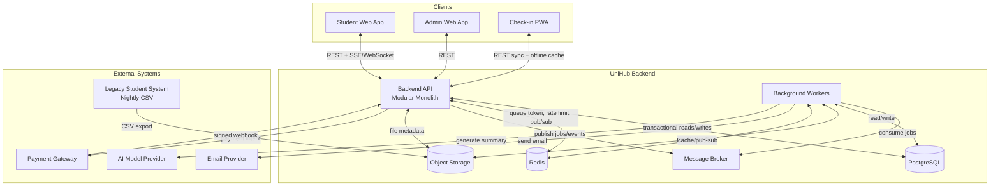
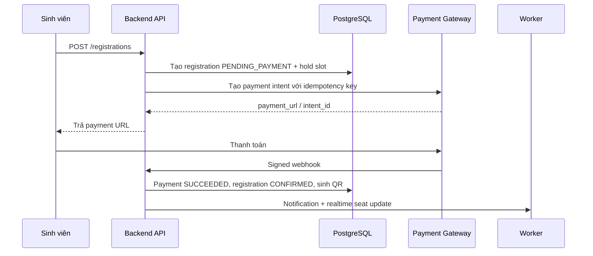
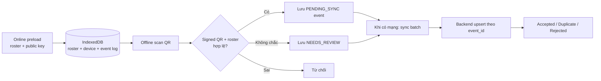
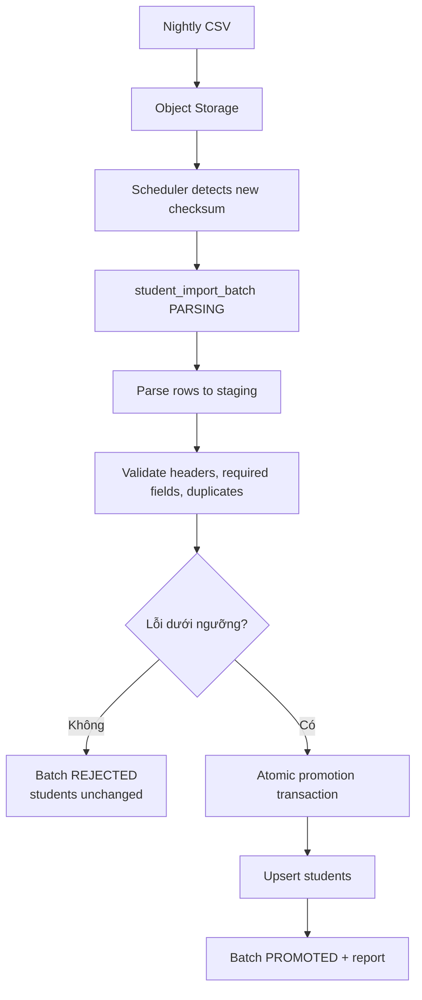

# UniHub Workshop - Application Blueprint

## 1. Mục đích blueprint

Blueprint này gom yêu cầu trong `requirements.md` và các đặc tả trong `docs/blueprint` thành một bản thiết kế tổng thể cho ứng dụng **UniHub Workshop**. Tài liệu này đóng vai trò entrypoint để nhóm phát triển hiểu:

- Hệ thống cần giải quyết bài toán gì.
- Người dùng nào sử dụng phần nào của ứng dụng.
- Các module nghiệp vụ được chia như thế nào.
- Luồng đăng ký, thanh toán, thông báo, check-in offline, AI summary và import CSV kết nối với nhau ra sao.
- Những quyết định kỹ thuật nào là cốt lõi để đảm bảo công bằng, chịu lỗi và mở rộng được.

Chi tiết sâu hơn nằm ở:

- `proposal.md`: vấn đề, mục tiêu, phạm vi và rủi ro.
- `design.md`: kiến trúc tổng thể, C4, ERD và ADR.
- `specs/*.md`: đặc tả riêng cho từng capability.

## 2. Tầm nhìn sản phẩm

UniHub Workshop số hóa toàn bộ quy trình "Tuần lễ kỹ năng và nghề nghiệp" của trường đại học, từ lúc sinh viên xem lịch workshop đến lúc nhận QR và check-in tại cửa phòng.

Hệ thống thay thế Google Form và email thủ công bằng một nền tảng gồm:

- Student Web App để xem lịch, lọc workshop, đăng ký, thanh toán và xem QR.
- Admin Web App để ban tổ chức quản lý workshop, upload PDF, xem thống kê và quản lý import.
- Check-in PWA offline-first để nhân sự check-in quét QR bằng thiết bị di động.
- Backend API modular monolith xử lý nghiệp vụ đồng bộ.
- Background workers xử lý công việc bất đồng bộ, dễ lỗi và cần retry.
- PostgreSQL làm source of truth, Redis cho dữ liệu tạm thời/realtime/rate limit, object storage cho PDF/CSV.

## 3. Người dùng và mục tiêu

| Người dùng | Mục tiêu | Năng lực chính |
| --- | --- | --- |
| Sinh viên | Xem và đăng ký workshop công bằng, nhận QR rõ ràng | Browse workshop, xem số chỗ còn lại, đăng ký miễn phí/có phí, thanh toán, nhận email/in-app notification |
| Ban tổ chức | Vận hành sự kiện và theo dõi số liệu | Tạo/sửa/hủy workshop, đổi phòng/giờ, upload PDF, xem thống kê, theo dõi import và AI summary |
| Nhân sự check-in | Xác nhận sinh viên tham dự tại cửa phòng | Preload roster, quét QR, check-in offline, sync lại khi có mạng |
| Admin hệ thống | Kiểm soát truy cập và cấu hình | Quản lý user, role, cấu hình hệ thống, audit các thao tác quan trọng |

## 4. Phạm vi MVP

### Trong phạm vi

- Xác thực email/mật khẩu, JWT access token, refresh token rotation và RBAC.
- Danh sách workshop, chi tiết workshop, số chỗ còn lại gần thời gian thực.
- Đăng ký workshop miễn phí và có phí.
- Chống oversell bằng PostgreSQL transaction, row lock và hold slot.
- Virtual queue và token bucket rate limiting cho giờ cao điểm.
- Thanh toán bất đồng bộ với payment intent, webhook, idempotency key và circuit breaker.
- Notification qua in-app và email, thiết kế channel adapter để thêm Telegram sau này.
- Check-in PWA offline-first với signed QR, local roster và IndexedDB event log.
- Import dữ liệu sinh viên từ CSV theo batch, staging table, validation và atomic promotion.
- AI summary cho PDF workshop theo pipe-and-filter, xử lý qua worker.
- Audit log cho các thao tác quan trọng.

### Ngoài phạm vi ban đầu

- Native mobile app riêng cho check-in.
- Payment gateway production thật.
- SSO chính thức với hệ thống định danh của trường.
- Microservices độc lập cho từng module.
- Kubernetes/autoscaling/observability dashboard đầy đủ.
- Rule engine thông báo do admin tự cấu hình.
- Phân quyền check-in scoped chi tiết theo từng phòng/workshop.

## 5. Chất lượng hệ thống mục tiêu

| Chất lượng | Mục tiêu thiết kế |
| --- | --- |
| Công bằng | 12.000 sinh viên có thể vào hệ thống trong 10 phút đầu; request đăng ký đi qua virtual queue và rate limit |
| Nhất quán | Registration, payment, seat count và check-in được bảo vệ bằng transaction, unique constraint và idempotency |
| Chịu lỗi | Payment, email, AI và CSV import lỗi không làm sập các chức năng còn lại |
| Offline-first | PWA check-in vẫn ghi nhận được event khi mất mạng và sync idempotent khi online lại |
| Mở rộng | Notification channel, payment adapter, AI pipeline và import pipeline có boundary riêng |
| Truy vết | Audit log, import batch report, notification delivery status và payment webhook history giúp debug/sao kê |

## 6. Kiến trúc tổng thể

Hệ thống dùng **Modular Monolith + Background Workers**.



### Lý do chọn modular monolith

- Phù hợp nhóm nhỏ và đồ án môn học: ít chi phí vận hành hơn microservices.
- Vẫn giữ được boundary theo module: Auth, Workshop, Registration, Payment, Notification, Check-in, Import, AI Summary.
- Dễ test end-to-end các luồng có transaction liên module.
- Có thể tách module nặng thành service riêng sau khi có nhu cầu scale thật.

## 7. Module blueprint

| Module | Trách nhiệm | Phụ thuộc chính | Ghi chú boundary |
| --- | --- | --- | --- |
| Auth/RBAC | Đăng nhập, token, refresh, role guard, audit auth | PostgreSQL, Redis blocklist | Backend enforce quyền; frontend chỉ ẩn/hiện UI |
| Workshop | CRUD workshop, lịch, phòng, capacity, PDF metadata | PostgreSQL, object storage | Không tự gọi AI/payment/notification trực tiếp ngoài event |
| Registration | Đăng ký, hold slot, seat count, QR generation | PostgreSQL, Redis queue token | Source of truth cho số chỗ là DB transaction |
| Payment | Payment intent, webhook, reconcile, circuit breaker | Payment gateway, PostgreSQL, Redis | Không tin client redirect để confirm |
| Notification | In-app/email delivery, retry, channel adapter | Queue, email provider, PostgreSQL | Nhận domain event qua outbox; mỗi channel retry độc lập |
| Check-in | Preload roster, verify QR, sync offline event | PWA, IndexedDB, PostgreSQL | Server là source of truth cuối cùng |
| Student Import | Parse CSV, validate, staging, atomic promotion | Object storage, PostgreSQL | CSV lỗi không được làm đổi bảng `students` |
| AI Summary | Extract PDF, clean text, chunk, call AI, publish summary | Object storage, AI provider, queue | Xử lý async; upload không chờ AI xong |
| Realtime/Load Protection | SSE/WebSocket, virtual queue, token bucket | Redis, Backend API | Realtime chỉ là view; registration vẫn check DB |

## 8. Luồng nghiệp vụ cốt lõi

### 8.1 Đăng ký workshop miễn phí

```mermaid
sequenceDiagram
    participant S as Sinh viên
    participant Web as Student Web
    participant API as Backend API
    participant DB as PostgreSQL
    participant N as Notification Worker

    S->>Web: Bấm Đăng ký
    Web->>API: POST /registrations + queue token + Idempotency-Key
    API->>API: Auth, RBAC, rate limit, queue token
    API->>DB: BEGIN; lock workshop row
    DB-->>API: Workshop còn chỗ
    API->>DB: Tạo registration CONFIRMED, tăng confirmed_count
    API->>DB: COMMIT
    API-->>Web: Registration + QR
    API->>N: RegistrationConfirmed event
    N-->>S: Email + in-app notification
```

Quyết định cốt lõi:

- Transaction giữ lock ngắn, không gọi email/payment trong lock.
- Unique active registration theo `(student_id, workshop_id)`.
- Retry cùng `Idempotency-Key` trả lại kết quả cũ.

### 8.2 Đăng ký workshop có phí



Quyết định cốt lõi:

- Payment webhook là nguồn xác nhận thanh toán.
- Payment intent và webhook handler idempotent.
- Hold slot hết hạn sẽ được worker expire để trả chỗ.
- Nếu gateway lỗi liên tục, circuit breaker Open: workshop miễn phí và xem lịch vẫn hoạt động.

### 8.3 Check-in offline



Quyết định cốt lõi:

- QR token phải được ký và có thời hạn.
- PWA có local roster nên vẫn check được khi mất mạng.
- Mỗi offline event có UUID riêng; server upsert theo `event_id`.
- Hai thiết bị scan cùng QR offline: server chấp nhận event đầu tiên, event sau duplicate.

### 8.4 Import sinh viên từ CSV



Quyết định cốt lõi:

- Không import trực tiếp vào bảng `students`.
- Checksum ngăn import trùng file.
- Promotion atomic để worker chết giữa chừng thì rollback an toàn.
- Hệ thống vẫn cho đăng ký trong lúc import chạy.

### 8.5 AI Summary PDF


Quyết định cốt lõi:

- Upload PDF trả về nhanh, không chờ AI xử lý xong.
- PDF > 20 MB bị từ chối ngay.
- AI timeout retry tối đa 3 lần.
- AI lỗi không ảnh hưởng xem/đăng ký workshop.

## 9. Mô hình dữ liệu chính

| Entity | Vai trò |
| --- | --- |
| `users`, `roles`, `user_roles` | Tài khoản và RBAC |
| `students` | Dữ liệu sinh viên được đồng bộ từ CSV |
| `workshops` | Thông tin workshop, capacity, status, summary |
| `registrations` | Trạng thái đăng ký, hold slot, QR token hash |
| `payments` | Payment intent, idempotency key, webhook payload |
| `checkin_events` | Event quét QR, sync offline, duplicate handling |
| `workshop_documents` | PDF upload và metadata xử lý |
| `student_import_batches`, `student_import_rows` | Audit import CSV và staging |
| `notification_events`, `notification_deliveries` | Outbox notification và trạng thái từng channel |

Ràng buộc quan trọng:

- `workshops.confirmed_count + workshops.held_count <= workshops.capacity`.
- Unique active registration cho mỗi `(student_id, workshop_id)`.
- `payments.payment_intent_id` và `payments.idempotency_key` unique.
- `checkin_events.event_id` unique để sync idempotent.
- `student_import_batches.checksum` unique.
- `notification_deliveries` unique theo `(event_id, channel)`.

## 10. Bảo vệ tải và công bằng khi mở đăng ký

Hệ thống kết hợp ba lớp:

1. **Virtual queue**: sinh viên lấy queue token gắn với `user_id + workshop_id`; token có TTL 120 giây và chỉ dùng một lần.
2. **Token bucket rate limit**: giới hạn request theo endpoint tier.
3. **DB transaction + row lock**: đảm bảo quyết định cuối cùng về số chỗ nằm trong PostgreSQL.

| Endpoint tier | Key | Burst | Refill | Khi vượt ngưỡng |
| --- | --- | --- | --- | --- |
| Xem lịch công khai | `ip` | 60 | 10/s | `429` + `Retry-After: 5s` |
| Đăng nhập | `ip` | 10 | 1/s | `429` + `Retry-After: 10s` |
| Đăng ký workshop | `user_id+workshop_id` | 5 | 1/30s | `429` + `Retry-After: 30s` |
| Admin thao tác | `user_id` | 30 | 5/s | `429` + `Retry-After: 5s` |

Realtime seat update qua SSE/WebSocket giúp UI cập nhật nhanh, nhưng không bao giờ thay thế transaction khi đăng ký.

## 11. Bảo mật và truy cập

- Access token JWT TTL 15 phút.
- Refresh token TTL 7 ngày, rotate mỗi lần refresh, revoke token cũ bằng Redis blocklist.
- Mật khẩu hash bằng bcrypt cost factor >= 12.
- Backend enforce role và ownership cho mỗi API.
- Payment webhook xác thực bằng chữ ký gateway, không dùng user session.
- Audit log cho đăng nhập, đổi role, tạo/hủy workshop, revoke token và thao tác admin quan trọng.

Role ban đầu:

| Role | Quyền |
| --- | --- |
| `STUDENT` | Xem workshop, đăng ký, thanh toán, xem QR của chính mình |
| `ORGANIZER` | Quản lý workshop, upload PDF, xem thống kê, quản lý import |
| `CHECKIN_STAFF` | Preload roster, quét QR, sync check-in |
| `ADMIN` | Quản lý user/role/cấu hình, có quyền organizer |

## 12. Chịu lỗi và graceful degradation

| Thành phần lỗi | Hệ thống phản ứng |
| --- | --- |
| Payment gateway down | Circuit breaker Open; từ chối đăng ký có phí bằng 503; xem lịch và đăng ký miễn phí vẫn chạy |
| Email provider lỗi | Delivery retry; in-app vẫn gửi được; registration không rollback |
| AI provider timeout | Retry 3 lần; nếu thất bại thì `SUMMARY_FAILED`; workshop vẫn hiển thị |
| Redis pub/sub lỗi | Realtime degrade; registration vẫn dùng DB làm source of truth |
| CSV file lỗi | Batch `REJECTED`; bảng `students` không đổi |
| PWA mất mạng | Event lưu IndexedDB và sync lại sau |

## 13. API surface gợi ý

| Nhóm API | Endpoint gợi ý | Role |
| --- | --- | --- |
| Auth | `POST /auth/login`, `POST /auth/refresh`, `POST /auth/logout` | Public/authenticated |
| Workshop public | `GET /workshops`, `GET /workshops/:id`, `GET /workshops/:id/seats/stream` | Public/Student |
| Registration | `POST /registrations`, `GET /me/registrations`, `GET /me/registrations/:id/qr` | `STUDENT` |
| Payment | `POST /payments/:registrationId/intent`, `POST /payments/webhook` | `STUDENT` / gateway signature |
| Admin workshop | `POST /admin/workshops`, `PATCH /admin/workshops/:id`, `POST /admin/workshops/:id/cancel` | `ORGANIZER`, `ADMIN` |
| Documents/AI | `POST /admin/workshops/:id/documents`, `GET /admin/workshops/:id/summary-status` | `ORGANIZER`, `ADMIN` |
| Check-in | `POST /checkin/preload`, `POST /checkin/sync` | `CHECKIN_STAFF`, `ADMIN` |
| Import | `POST /admin/imports/students`, `GET /admin/imports/students/:batchId` | `ORGANIZER`, `ADMIN` |
| Notification | `GET /me/notifications`, `PATCH /me/notifications/:id/read` | Authenticated |

## 14. Implementation slices để dễ làm theo nhóm

1. **Foundation**: Auth/RBAC, user/role schema, audit log, base API structure.
2. **Workshop catalog**: workshop CRUD, public listing, room/map fields, basic admin UI.
3. **Registration core**: seat transaction, idempotency key, free registration, QR generation.
4. **Load protection + realtime**: Redis token bucket, virtual queue, SSE/WebSocket seat updates.
5. **Payment**: payment intent, webhook, circuit breaker, hold expiration/reconcile worker.
6. **Notification**: outbox, in-app/email adapters, retry policy.
7. **Check-in PWA**: preload roster, signed QR verify, IndexedDB event log, sync API.
8. **Student import**: CSV staging, validation, atomic promotion, batch report.
9. **AI summary**: PDF upload, extract/clean/chunk pipeline, AI worker, summary status.
10. **Hardening**: concurrency tests, offline sync tests, rate-limit tests, payment timeout tests, admin audit.

## 15. Tiêu chí chấp nhận tổng thể

- 100 request đồng thời tranh 1 chỗ cuối chỉ tạo được 1 registration active.
- Retry cùng idempotency key không tạo registration/payment/check-in trùng.
- 12.000 sinh viên trong 10 phút đầu không được gửi thẳng toàn bộ request vào registration API.
- Payment gateway down không làm ảnh hưởng xem lịch và đăng ký workshop miễn phí.
- Check-in PWA preload xong có thể quét offline và sync lại không mất event.
- CSV lỗi không làm thay đổi bảng `students` hiện tại.
- PDF upload trả về nhanh; AI summary thất bại không ảnh hưởng workshop.
- Registration thành công tạo QR và thông báo qua in-app/email.
- Backend từ chối đúng cách các request sai role hoặc sai ownership.
- Admin có thể truy vết import batch, notification delivery, payment status và các thao tác quan trọng.

## 16. Câu hỏi cần chốt trước khi implement

- Workshop có giới hạn sinh viên đăng ký trùng khung giờ hay không?
- Chính sách khi payment thành công sau khi hold slot đã hết hạn là hoàn tiền tự động hay `NEEDS_REVIEW` thủ công?
- QR token hết hạn theo workshop end time hay theo một TTL riêng?
- Check-in staff có được preload tất cả workshop hay chỉ workshop được phân công?
- Import CSV có đánh dấu sinh viên vắng mặt trong file mới là `INACTIVE` ngay hay cần grace period?
- AI summary có cần admin review trước khi publish cho sinh viên hay auto-publish với nhãn `AI_GENERATED` là đủ?

## 17. Bản đồ traceability yêu cầu

| Yêu cầu trong bài | Module/spec phụ trách |
| --- | --- |
| Xem workshop, speaker, phòng, map, số chỗ realtime | Workshop, Realtime |
| Đăng ký miễn phí/có phí, nhận QR | Registration, Payment |
| Thông báo app/email, dễ thêm Telegram | Notification |
| Admin tạo/sửa/đổi phòng/đổi giờ/hủy workshop | Workshop, Auth/RBAC |
| Phân quyền sinh viên/organizer/check-in staff | Auth/RBAC |
| Check-in QR bằng mobile app khi mạng yếu | Check-in PWA |
| PDF AI summary pipe-and-filter | AI Summary |
| Đồng bộ sinh viên từ CSV batch sequential | Student Import |
| Tranh chấp chỗ ngồi | Registration transaction + row lock |
| Tải đột biến và fairness | Virtual Queue + Rate Limit |
| Payment không ổn định, timeout, double charge | Payment + Circuit Breaker + Idempotency |
| Tích hợp một chiều với hệ thống cũ | Student Import staging + atomic promotion |
