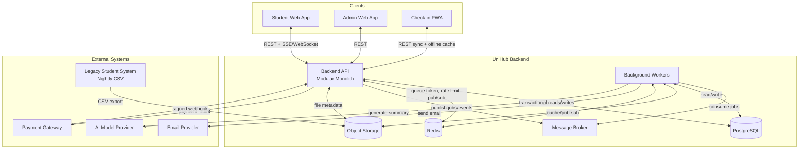
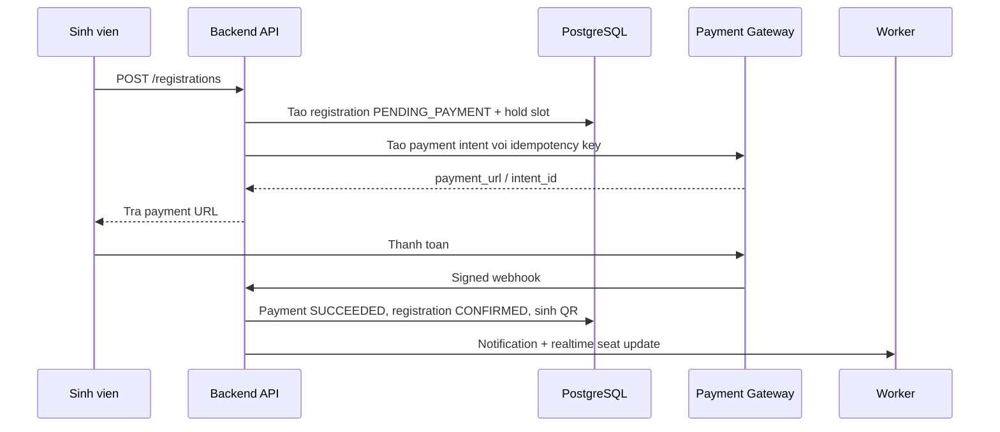
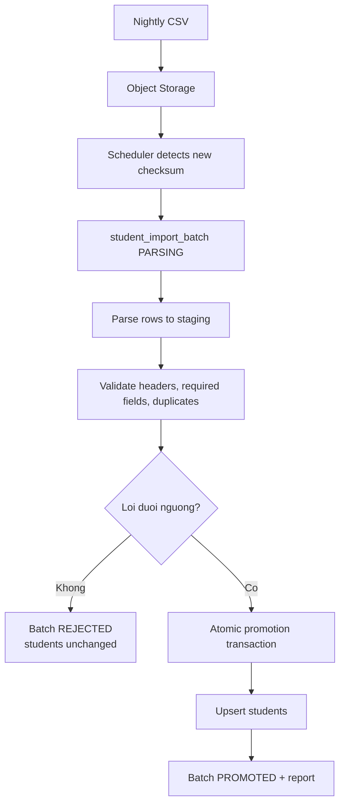
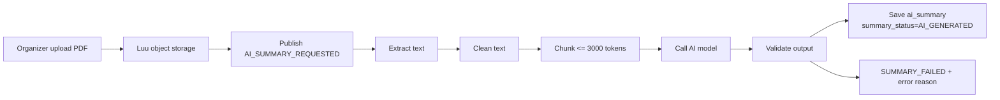

# UniHub Workshop - Application Blueprint

## 1. Muc dich blueprint

Blueprint nay gom yeu cau trong `requirements.md` va cac dac ta trong `docs/blueprint` thanh mot ban thiet ke tong the cho ung dung **UniHub Workshop**. Tai lieu nay dong vai tro entrypoint de nhom phat trien hieu:

- He thong can giai quyet bai toan gi.
- Nguoi dung nao su dung phan nao cua ung dung.
- Cac module nghiep vu duoc chia nhu the nao.
- Luong dang ky, thanh toan, thong bao, check-in offline, AI summary va import CSV ket noi voi nhau ra sao.
- Nhung quyet dinh ky thuat nao la cot loi de dam bao cong bang, chiu loi va mo rong duoc.

Chi tiet sau hon nam o:

- `proposal.md`: van de, muc tieu, pham vi va rui ro.
- `design.md`: kien truc tong the, C4, ERD va ADR.
- `specs/*.md`: dac ta rieng cho tung capability.

## 2. Tam nhin san pham

UniHub Workshop so hoa toan bo quy trinh "Tuan le ky nang va nghe nghiep" cua truong dai hoc, tu luc sinh vien xem lich workshop den luc nhan QR va check-in tai cua phong.

He thong thay the Google Form va email thu cong bang mot nen tang gom:

- Student Web App de xem lich, loc workshop, dang ky, thanh toan va xem QR.
- Admin Web App de ban to chuc quan ly workshop, upload PDF, xem thong ke va quan ly import.
- Check-in PWA offline-first de nhan su check-in quet QR bang thiet bi di dong.
- Backend API modular monolith xu ly nghiep vu dong bo.
- Background workers xu ly cong viec bat dong bo, de loi va can retry.
- PostgreSQL lam source of truth, Redis cho du lieu tam thoi/realtime/rate limit, object storage cho PDF/CSV.

## 3. Nguoi dung va muc tieu

| Nguoi dung | Muc tieu | Nang luc chinh |
| --- | --- | --- |
| Sinh vien | Xem va dang ky workshop cong bang, nhan QR ro rang | Browse workshop, xem so cho con lai, dang ky mien phi/co phi, thanh toan, nhan email/in-app notification |
| Ban to chuc | Van hanh su kien va theo doi so lieu | Tao/sua/huy workshop, doi phong/gio, upload PDF, xem thong ke, theo doi import va AI summary |
| Nhan su check-in | Xac nhan sinh vien tham du tai cua phong | Preload roster, quet QR, check-in offline, sync lai khi co mang |
| Admin he thong | Kiem soat truy cap va cau hinh | Quan ly user, role, cau hinh he thong, audit cac thao tac quan trong |

## 4. Pham vi MVP

### Trong pham vi

- Xac thuc email/mat khau, JWT access token, refresh token rotation va RBAC.
- Danh sach workshop, chi tiet workshop, so cho con lai gan thoi gian thuc.
- Dang ky workshop mien phi va co phi.
- Chong oversell bang PostgreSQL transaction, row lock va hold slot.
- Virtual queue va token bucket rate limiting cho gio cao diem.
- Thanh toan bat dong bo voi payment intent, webhook, idempotency key va circuit breaker.
- Notification qua in-app va email, thiet ke channel adapter de them Telegram sau nay.
- Check-in PWA offline-first voi signed QR, local roster va IndexedDB event log.
- Import du lieu sinh vien tu CSV theo batch, staging table, validation va atomic promotion.
- AI summary cho PDF workshop theo pipe-and-filter, xu ly qua worker.
- Audit log cho cac thao tac quan trong.

### Ngoai pham vi ban dau

- Native mobile app rieng cho check-in.
- Payment gateway production that.
- SSO chinh thuc voi he thong dinh danh cua truong.
- Microservices doc lap cho tung module.
- Kubernetes/autoscaling/observability dashboard day du.
- Rule engine thong bao do admin tu cau hinh.
- Phan quyen check-in scoped chi tiet theo tung phong/workshop.

## 5. Chat luong he thong muc tieu

| Chat luong | Muc tieu thiet ke |
| --- | --- |
| Cong bang | 12.000 sinh vien co the vao he thong trong 10 phut dau; request dang ky di qua virtual queue va rate limit |
| Nhat quan | Registration, payment, seat count va check-in duoc bao ve bang transaction, unique constraint va idempotency |
| Chiu loi | Payment, email, AI va CSV import loi khong lam sap cac chuc nang con lai |
| Offline-first | PWA check-in van ghi nhan duoc event khi mat mang va sync idempotent khi online lai |
| Mo rong | Notification channel, payment adapter, AI pipeline va import pipeline co boundary rieng |
| Truy vet | Audit log, import batch report, notification delivery status va payment webhook history giup debug/sao ke |

## 6. Kien truc tong the

He thong dung **Modular Monolith + Background Workers**.



### Ly do chon modular monolith

- Phu hop nhom nho va do an mon hoc: it chi phi van hanh hon microservices.
- Van giu duoc boundary theo module: Auth, Workshop, Registration, Payment, Notification, Check-in, Import, AI Summary.
- De test end-to-end cac luong co transaction lien module.
- Co the tach module nang thanh service rieng sau khi co nhu cau scale that.

## 7. Module blueprint

| Module | Trach nhiem | Phu thuoc chinh | Ghi chu boundary |
| --- | --- | --- | --- |
| Auth/RBAC | Dang nhap, token, refresh, role guard, audit auth | PostgreSQL, Redis blocklist | Backend enforce quyen; frontend chi an/hien UI |
| Workshop | CRUD workshop, lich, phong, capacity, PDF metadata | PostgreSQL, object storage | Khong tu goi AI/payment/notification truc tiep ngoai event |
| Registration | Dang ky, hold slot, seat count, QR generation | PostgreSQL, Redis queue token | Source of truth cho so cho la DB transaction |
| Payment | Payment intent, webhook, reconcile, circuit breaker | Payment gateway, PostgreSQL, Redis | Khong tin client redirect de confirm |
| Notification | In-app/email delivery, retry, channel adapter | Queue, email provider, PostgreSQL | Nhan domain event qua outbox; moi channel retry doc lap |
| Check-in | Preload roster, verify QR, sync offline event | PWA, IndexedDB, PostgreSQL | Server la source of truth cuoi cung |
| Student Import | Parse CSV, validate, staging, atomic promotion | Object storage, PostgreSQL | CSV loi khong duoc lam doi bang `students` |
| AI Summary | Extract PDF, clean text, chunk, call AI, publish summary | Object storage, AI provider, queue | Xu ly async; upload khong cho AI xong |
| Realtime/Load Protection | SSE/WebSocket, virtual queue, token bucket | Redis, Backend API | Realtime chi la view; registration van check DB |

## 8. Luong nghiep vu cot loi

### 8.1 Dang ky workshop mien phi

```mermaid
sequenceDiagram
    participant S as Sinh vien
    participant Web as Student Web
    participant API as Backend API
    participant DB as PostgreSQL
    participant N as Notification Worker

    S->>Web: Bam Dang ky
    Web->>API: POST /registrations + queue token + Idempotency-Key
    API->>API: Auth, RBAC, rate limit, queue token
    API->>DB: BEGIN; lock workshop row
    DB-->>API: Workshop con cho
    API->>DB: Tao registration CONFIRMED, tang confirmed_count
    API->>DB: COMMIT
    API-->>Web: Registration + QR
    API->>N: RegistrationConfirmed event
    N-->>S: Email + in-app notification
```

Quyet dinh cot loi:

- Transaction giu lock ngan, khong goi email/payment trong lock.
- Unique active registration theo `(student_id, workshop_id)`.
- Retry cung `Idempotency-Key` tra lai ket qua cu.

### 8.2 Dang ky workshop co phi



Quyet dinh cot loi:

- Payment webhook la nguon xac nhan thanh toan.
- Payment intent va webhook handler idempotent.
- Hold slot het han se duoc worker expire de tra cho.
- Neu gateway loi lien tuc, circuit breaker Open: workshop mien phi va xem lich van hoat dong.

### 8.3 Check-in offline


Quyet dinh cot loi:

- QR token phai duoc ky va co thoi han.
- PWA co local roster nen van check duoc khi mat mang.
- Moi offline event co UUID rieng; server upsert theo `event_id`.
- Hai thiet bi scan cung QR offline: server chap nhan event dau tien, event sau duplicate.

### 8.4 Import sinh vien tu CSV



Quyet dinh cot loi:

- Khong import truc tiep vao bang `students`.
- Checksum ngan import trung file.
- Promotion atomic de worker chet giua chung thi rollback an toan.
- He thong van cho dang ky trong luc import chay.

### 8.5 AI Summary PDF



Quyet dinh cot loi:

- Upload PDF tra ve nhanh, khong cho AI xu ly xong.
- PDF > 20 MB bi tu choi ngay.
- AI timeout retry toi da 3 lan.
- AI loi khong anh huong xem/dang ky workshop.

## 9. Mo hinh du lieu chinh

| Entity | Vai tro |
| --- | --- |
| `users`, `roles`, `user_roles` | Tai khoan va RBAC |
| `students` | Du lieu sinh vien duoc dong bo tu CSV |
| `workshops` | Thong tin workshop, capacity, status, summary |
| `registrations` | Trang thai dang ky, hold slot, QR token hash |
| `payments` | Payment intent, idempotency key, webhook payload |
| `checkin_events` | Event quet QR, sync offline, duplicate handling |
| `workshop_documents` | PDF upload va metadata xu ly |
| `student_import_batches`, `student_import_rows` | Audit import CSV va staging |
| `notification_events`, `notification_deliveries` | Outbox notification va trang thai tung channel |

Rang buoc quan trong:

- `workshops.confirmed_count + workshops.held_count <= workshops.capacity`.
- Unique active registration cho moi `(student_id, workshop_id)`.
- `payments.payment_intent_id` va `payments.idempotency_key` unique.
- `checkin_events.event_id` unique de sync idempotent.
- `student_import_batches.checksum` unique.
- `notification_deliveries` unique theo `(event_id, channel)`.

## 10. Bao ve tai va cong bang khi mo dang ky

He thong ket hop ba lop:

1. **Virtual queue**: sinh vien lay queue token gan voi `user_id + workshop_id`; token co TTL 120 giay va chi dung mot lan.
2. **Token bucket rate limit**: gioi han request theo endpoint tier.
3. **DB transaction + row lock**: dam bao quyet dinh cuoi cung ve so cho nam trong PostgreSQL.

| Endpoint tier | Key | Burst | Refill | Khi vuot nguong |
| --- | --- | --- | --- | --- |
| Xem lich cong khai | `ip` | 60 | 10/s | `429` + `Retry-After: 5s` |
| Dang nhap | `ip` | 10 | 1/s | `429` + `Retry-After: 10s` |
| Dang ky workshop | `user_id+workshop_id` | 5 | 1/30s | `429` + `Retry-After: 30s` |
| Admin thao tac | `user_id` | 30 | 5/s | `429` + `Retry-After: 5s` |

Realtime seat update qua SSE/WebSocket giup UI cap nhat nhanh, nhung khong bao gio thay the transaction khi dang ky.

## 11. Bao mat va truy cap

- Access token JWT TTL 15 phut.
- Refresh token TTL 7 ngay, rotate moi lan refresh, revoke token cu bang Redis blocklist.
- Mat khau hash bang bcrypt cost factor >= 12.
- Backend enforce role va ownership cho moi API.
- Payment webhook xac thuc bang chu ky gateway, khong dung user session.
- Audit log cho dang nhap, doi role, tao/huy workshop, revoke token va thao tac admin quan trong.

Role ban dau:

| Role | Quyen |
| --- | --- |
| `STUDENT` | Xem workshop, dang ky, thanh toan, xem QR cua chinh minh |
| `ORGANIZER` | Quan ly workshop, upload PDF, xem thong ke, quan ly import |
| `CHECKIN_STAFF` | Preload roster, quet QR, sync check-in |
| `ADMIN` | Quan ly user/role/cau hinh, co quyen organizer |

## 12. Chiu loi va graceful degradation

| Thanh phan loi | He thong phan ung |
| --- | --- |
| Payment gateway down | Circuit breaker Open; tu choi dang ky co phi bang 503; xem lich va dang ky mien phi van chay |
| Email provider loi | Delivery retry; in-app van gui duoc; registration khong rollback |
| AI provider timeout | Retry 3 lan; neu that bai thi `SUMMARY_FAILED`; workshop van hien thi |
| Redis pub/sub loi | Realtime degrade; registration van dung DB lam source of truth |
| CSV file loi | Batch `REJECTED`; bang `students` khong doi |
| PWA mat mang | Event luu IndexedDB va sync lai sau |

## 13. API surface goi y

| Nhom API | Endpoint goi y | Role |
| --- | --- | --- |
| Auth | `POST /auth/login`, `POST /auth/refresh`, `POST /auth/logout` | Public/authenticated |
| Workshop public | `GET /workshops`, `GET /workshops/:id`, `GET /workshops/:id/seats/stream` | Public/Student |
| Registration | `POST /registrations`, `GET /me/registrations`, `GET /me/registrations/:id/qr` | `STUDENT` |
| Payment | `POST /payments/:registrationId/intent`, `POST /payments/webhook` | `STUDENT` / gateway signature |
| Admin workshop | `POST /admin/workshops`, `PATCH /admin/workshops/:id`, `POST /admin/workshops/:id/cancel` | `ORGANIZER`, `ADMIN` |
| Documents/AI | `POST /admin/workshops/:id/documents`, `GET /admin/workshops/:id/summary-status` | `ORGANIZER`, `ADMIN` |
| Check-in | `POST /checkin/preload`, `POST /checkin/sync` | `CHECKIN_STAFF`, `ADMIN` |
| Import | `POST /admin/imports/students`, `GET /admin/imports/students/:batchId` | `ORGANIZER`, `ADMIN` |
| Notification | `GET /me/notifications`, `PATCH /me/notifications/:id/read` | Authenticated |

## 14. Implementation slices de de lam theo nhom

1. **Foundation**: Auth/RBAC, user/role schema, audit log, base API structure.
2. **Workshop catalog**: workshop CRUD, public listing, room/map fields, basic admin UI.
3. **Registration core**: seat transaction, idempotency key, free registration, QR generation.
4. **Load protection + realtime**: Redis token bucket, virtual queue, SSE/WebSocket seat updates.
5. **Payment**: payment intent, webhook, circuit breaker, hold expiration/reconcile worker.
6. **Notification**: outbox, in-app/email adapters, retry policy.
7. **Check-in PWA**: preload roster, signed QR verify, IndexedDB event log, sync API.
8. **Student import**: CSV staging, validation, atomic promotion, batch report.
9. **AI summary**: PDF upload, extract/clean/chunk pipeline, AI worker, summary status.
10. **Hardening**: concurrency tests, offline sync tests, rate-limit tests, payment timeout tests, admin audit.

## 15. Tieu chi chap nhan tong the

- 100 request dong thoi tranh 1 cho cuoi chi tao duoc 1 registration active.
- Retry cung idempotency key khong tao registration/payment/check-in trung.
- 12.000 sinh vien trong 10 phut dau khong duoc gui thang toan bo request vao registration API.
- Payment gateway down khong lam anh huong xem lich va dang ky workshop mien phi.
- Check-in PWA preload xong co the quet offline va sync lai khong mat event.
- CSV loi khong lam thay doi bang `students` hien tai.
- PDF upload tra ve nhanh; AI summary that bai khong anh huong workshop.
- Registration thanh cong tao QR va thong bao qua in-app/email.
- Backend tu choi dung cach cac request sai role hoac sai ownership.
- Admin co the truy vet import batch, notification delivery, payment status va cac thao tac quan trong.

## 16. Cau hoi can chot truoc khi implement

- Workshop co gioi han sinh vien dang ky trung khung gio hay khong?
- Chinh sach khi payment thanh cong sau khi hold slot da het han la hoan tien tu dong hay `NEEDS_REVIEW` thu cong?
- QR token het han theo workshop end time hay theo mot TTL rieng?
- Check-in staff co duoc preload tat ca workshop hay chi workshop duoc phan cong?
- Import CSV co danh dau sinh vien vang mat trong file moi la `INACTIVE` ngay hay can grace period?
- AI summary co can admin review truoc khi publish cho sinh vien hay auto-publish voi nhan `AI_GENERATED` la du?

## 17. Ban do traceability yeu cau

| Yeu cau trong bai | Module/spec phu trach |
| --- | --- |
| Xem workshop, speaker, phong, map, so cho realtime | Workshop, Realtime |
| Dang ky mien phi/co phi, nhan QR | Registration, Payment |
| Thong bao app/email, de them Telegram | Notification |
| Admin tao/sua/doi phong/doi gio/huy workshop | Workshop, Auth/RBAC |
| Phan quyen sinh vien/organizer/check-in staff | Auth/RBAC |
| Check-in QR bang mobile app khi mang yeu | Check-in PWA |
| PDF AI summary pipe-and-filter | AI Summary |
| Dong bo sinh vien tu CSV batch sequential | Student Import |
| Tranh chap cho ngoi | Registration transaction + row lock |
| Tai dot bien va fairness | Virtual Queue + Rate Limit |
| Payment khong on dinh, timeout, double charge | Payment + Circuit Breaker + Idempotency |
| Tich hop mot chieu voi he thong cu | Student Import staging + atomic promotion |
