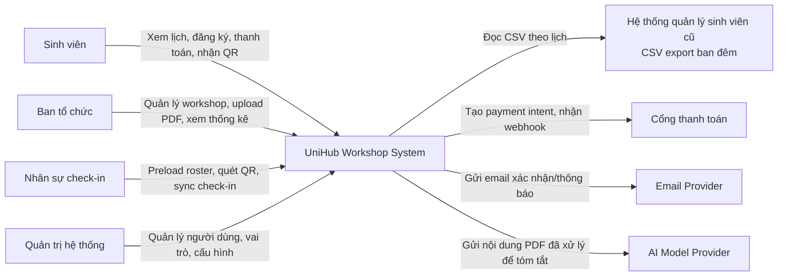
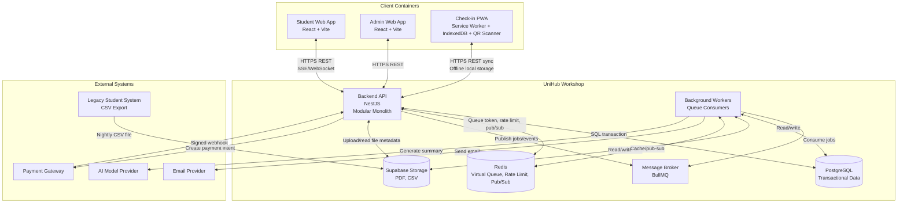
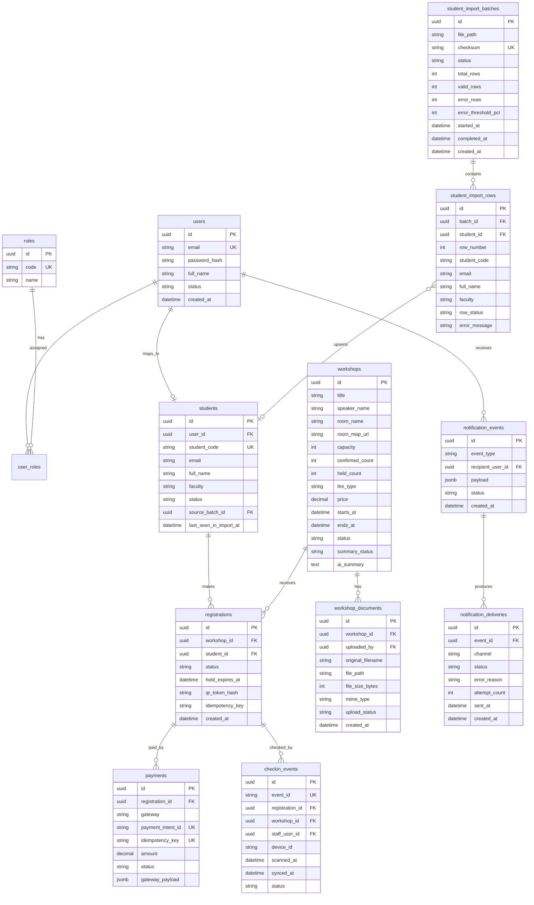

# UniHub Workshop - Technical Design

## Kiến trúc tổng thể

UniHub Workshop sử dụng kiến trúc **Modular Monolith + Background Workers**. Backend là một ứng dụng duy nhất, nhưng được chia thành các module nghiệp vụ độc lập: Auth/RBAC, Workshop, Registration, Payment, Notification, Check-in, Student Import, AI Summary và Realtime.

Các request cần phản hồi ngay được xử lý bởi Backend API. Các tác vụ tốn thời gian, dễ lỗi hoặc cần retry được đưa vào queue cho background workers xử lý, ví dụ gửi email, expire hold slot, payment reconcile, import CSV và tạo AI summary.

Lý do lựa chọn:

- Đơn giản hơn microservices trong phát triển và vận hành.
- Vẫn có boundary rõ ràng giữa các nghiệp vụ.
- Phù hợp nhóm nhỏ và bối cảnh đồ án/hệ thống trường đại học.
- Có thể mở rộng sau này bằng cách tách các module nặng như Payment, Notification hoặc AI thành service riêng.

Khi một phần gặp sự cố:

- Payment lỗi không làm hỏng xem lịch hoặc workshop miễn phí nhờ circuit breaker và graceful degradation.
- Email lỗi không làm rollback registration vì notification chạy async.
- AI lỗi chỉ làm summary chuyển `SUMMARY_FAILED`, workshop vẫn hoạt động.
- CSV lỗi bị reject ở staging, không ảnh hưởng bảng `students`.
- Mất mạng tại điểm check-in không làm mất dữ liệu vì PWA lưu event trong IndexedDB.

## C4 Diagram

### Level 1 - System Context

### Level 2 - Container

## High-Level Architecture Diagram

## Các luồng nghiệp vụ quan trọng

Chi tiết từng luồng xem tại các file spec riêng.

### Luồng đăng ký workshop có phí

> Chi tiết: [`specs/registration.md`](specs/registration.md) → [`specs/payment.md`](specs/payment.md)

1. Sinh viên bấm "Đăng ký" trên Student Web App — frontend gửi kèm queue token và `Idempotency-Key`.
2. Backend kiểm tra auth, role `STUDENT`, rate limit và queue token.
3. Mở DB transaction, khóa dòng workshop bằng row lock.
4. Kiểm tra workshop còn chỗ và đang mở đăng ký — tạo registration `PENDING_PAYMENT`, đặt `hold_expires_at`, tăng `held_count`.
5. Transaction commit. API trả payment URL cho frontend.
6. Payment Adapter gọi gateway tạo payment intent (kèm idempotency key).
7. Sinh viên thanh toán trên trang gateway.
8. Gateway gửi signed webhook — backend xác thực chữ ký, chuyển payment `SUCCEEDED`.
9. Registration chuyển `CONFIRMED`, giảm `held_count`, tăng `confirmed_count`, sinh QR token.
10. Notification worker gửi xác nhận qua in-app và email.

**Xử lý lỗi giữa chừng:** Nếu client timeout sau khi thanh toán — webhook vẫn đến và xử lý đúng, sinh viên không cần thanh toán lại. Nếu hold hết hạn trước khi webhook đến — chuyển `NEEDS_REVIEW` và xử lý theo chính sách hoàn tiền.

### Luồng check-in khi mất mạng và đồng bộ lại

> Chi tiết: [`specs/checkin.md`](specs/checkin.md)

**Chuẩn bị (có mạng):** Staff đăng nhập bằng tài khoản `CHECKIN_STAFF`, PWA preload roster các registration hợp lệ và public key vào IndexedDB.

**Scan offline:** PWA decode QR, kiểm tra chữ ký và tra IndexedDB local. Nếu hợp lệ, ghi `checkin_event_id` (UUID) vào IndexedDB với trạng thái `PENDING_SYNC`.

**Đồng bộ (có mạng lại):** PWA gửi batch event lên API. Backend upsert theo `event_id` (idempotent) — gửi lại nhiều lần không tạo check-in trùng.

**Xử lý lỗi giữa chừng:** PWA bị đóng khi offline — event vẫn nằm trong IndexedDB, đồng bộ lại sau khi mở lại. Hai thiết bị scan cùng QR offline — server accepted event đầu tiên, event sau bị đánh dấu duplicate.

### Luồng nhập dữ liệu từ CSV đêm

> Chi tiết: [`specs/student-import.md`](specs/student-import.md)

1. Hệ thống cũ export CSV vào object storage theo lịch đêm.
2. Scheduler phát hiện file mới qua checksum — tạo `student_import_batch` trạng thái `PARSING`.
3. Worker parse từng dòng vào staging table `student_import_rows`, validate header + required fields + trùng.
4. Nếu tỷ lệ lỗi dưới ngưỡng, mở transaction upsert vào `students` — promotion atomic.
5. Batch chuyển `PROMOTED`, admin xem báo cáo.

**Xử lý lỗi giữa chừng:** File thiếu cột — batch `REJECTED`, bảng `students` không đổi. Worker chết khi promote — transaction rollback, retry an toàn. Hệ thống vẫn cho đăng ký trong lúc import chạy.

## Thiết kế cơ sở dữ liệu

### Lựa chọn database

Database chính là **PostgreSQL** vì hệ thống cần transaction mạnh, unique constraint, quan hệ dữ liệu rõ ràng và row-level locking để chống oversell. Redis được dùng cho dữ liệu tạm như virtual queue, rate limit, pub/sub realtime. Object storage lưu PDF và CSV.

Không chọn NoSQL làm database chính vì registration, payment và check-in cần tính nhất quán, audit và ràng buộc quan hệ tốt.

### Entity chính

### Ràng buộc schema quan trọng

- `workshops.confirmed_count + workshops.held_count <= workshops.capacity`.
- Unique partial index để một sinh viên chỉ có một registration active cho một workshop (exclude `CANCELLED`, `EXPIRED`).
- `payments.payment_intent_id` và `payments.idempotency_key` là unique.
- `checkin_events.event_id` là unique để sync idempotent.
- Unique constraint logic theo `registration_id + workshop_id` cho check-in accepted để chống check-in nhiều lần.
- `student_import_batches.checksum` là unique, giúp phát hiện import trùng file.
- `student_import_rows.row_status` phân biệt: `VALID`, `ERROR`, `DUPLICATE`.
- `notification_deliveries` unique theo `(event_id, channel)` để tránh gửi trùng kênh.
- `workshop_documents.upload_status` theo dõi tiến trình xử lý PDF: `UPLOADED`, `PROCESSING`, `DONE`, `FAILED`.
- `workshops.summary_status` theo dõi AI: `PENDING`, `PROCESSING`, `AI_GENERATED`, `ADMIN_EDITED`, `SUMMARY_FAILED`.

## Thiết kế kiểm soát truy cập

Hệ thống dùng **RBAC đơn giản** với các role:

| Role | Quyền |
| --- | --- |
| `STUDENT` | Xem workshop, đăng ký, thanh toán, xem QR của chính mình |
| `ORGANIZER` | Tạo/sửa/hủy workshop, upload PDF, xem thống kê, quản lý import |
| `CHECKIN_STAFF` | Dùng Check-in PWA, preload roster, sync check-in event |
| `ADMIN` | Quản lý user/role/cấu hình, có toàn quyền organizer |

Backend enforce quyền tại API bằng middleware/guard. Frontend chỉ ẩn/hiện UI, không được xem là lớp bảo mật chính.

Ví dụ endpoint:

- `POST /registrations`: yêu cầu `STUDENT`.
- `POST /admin/workshops`: yêu cầu `ORGANIZER` hoặc `ADMIN`.
- `POST /checkin/preload`: yêu cầu `CHECKIN_STAFF` hoặc `ADMIN`.
- `POST /payment/webhook`: xác thực bằng chữ ký gateway, không dùng user role.

## Thiết kế các cơ chế bảo vệ hệ thống

### Kiểm soát tải đột biến

Giải pháp: **Virtual Queue + Token Bucket Rate Limiting + Idempotency**.

#### Lựa chọn thuật toán: Token Bucket

So sánh các thuật toán phổ biến:

| Thuật toán | Cho phép burst? | Phân phối đều? | Phù hợp bài toán? |
| --- | --- | --- | --- |
| Fixed Window | Có (biên cửa sổ) | Không | ❌ Dễ bị tấn công biên cửa sổ |
| Sliding Window | Không | Có | ✅ Tốt nhưng tốn bộ nhớ Redis hơn |
| Token Bucket | Có (burst giới hạn) | Có | ✅ **Được chọn** — cân bằng tốt |
| Leaky Bucket | Không | Rất đều | ❌ Quá nghiêm ngặt với burst hợp lệ |

Token Bucket được chọn vì cho phép burst nhỏ khi sinh viên mở trang đồng loạt nhưng vẫn giới hạn tốc độ trung bình. Redis lưu `(tokens, last_refill_ts)` theo key — mỗi giây nạp lại `refill_rate` token, mỗi request tiêu 1 token.

#### Ngưỡng cấu hình theo endpoint tier

| Endpoint tier | Key | Capacity (burst) | Refill rate | Hành vi vượt ngưỡng |
| --- | --- | --- | --- | --- |
| Công khai (xem lịch) | `ip` | 60 token | 10 token/s | `429` + `Retry-After: 5s` |
| Đăng nhập | `ip` | 10 token | 1 token/s | `429` + `Retry-After: 10s` |
| Đăng ký workshop | `user_id + workshop_id` | 5 token | 1 token/30s | `429` + `Retry-After: 30s` |
| Admin thao tác | `user_id` | 30 token | 5 token/s | `429` + `Retry-After: 5s` |
| Webhook payment | IP gateway whitelist | Không giới hạn | — | Chỉ kiểm tra chữ ký |

#### Virtual Queue

Virtual queue phát token theo nhịp kiểm soát để chỉ một lượng request hợp lệ đi vào registration API mỗi giây. Token gắn với `user_id`, `workshop_id`, `issued_at`, `expires_at = issued_at + 120s`. Token chỉ dùng được 1 lần — sau khi dùng hoặc hết hạn bị xóa khỏi Redis.

Khi vượt ngưỡng bất kỳ tier nào, API trả `429 Too Many Requests` kèm header `Retry-After`.

### Xử lý cổng thanh toán không ổn định

Giải pháp: **Payment Adapter + Circuit Breaker + Graceful Degradation**.

#### Các trạng thái Circuit Breaker

| Trạng thái | Mô tả | Điều kiện chuyển tiếp |
| --- | --- | --- |
| **Closed** | Hoạt động bình thường, gọi gateway như thường | Chuyển sang **Open** khi ≥ 5 lỗi liên tiếp trong cửa sổ 30 giây |
| **Open** | Từ chối toàn bộ request thanh toán mới tức thì | Chuyển sang **Half-Open** sau 30 giây không thử |
| **Half-Open** | Cho qua tối đa 3 request thử nghiệm | Chuyển về **Closed** nếu cả 3 thành công; về **Open** nếu bất kỳ 1 thất bại |

#### Cấu hình ngưỡng

- **Failure threshold:** 5 lỗi liên tiếp (hoặc tỉ lệ lỗi > 50% trong 30s với ít nhất 10 request).
- **Timeout lỗi:** call gateway timeout sau 5 giây — tính là 1 lỗi.
- **Open duration:** 30 giây trước khi thử Half-Open.
- **Half-Open probe count:** 3 request — nếu cả 3 thành công mới reset về Closed.
- **State lưu tại:** Redis key `circuit_breaker:payment_gateway` với TTL tự động.

#### Graceful Degradation

Khi circuit **Open**, hệ thống phản ứng theo từng chức năng:

| Chức năng | Hành vi khi circuit Open |
| --- | --- |
| Xem lịch / danh sách workshop | ✅ Hoạt động bình thường |
| Đăng ký workshop miễn phí | ✅ Hoạt động bình thường |
| Đăng ký workshop có phí | ⚠️ Trả HTTP 503 kèm thông báo "Thanh toán tạm gián đoạn" |
| Admin quản lý workshop | ✅ Hoạt động bình thường |
| Webhook payment đến | ✅ Vẫn xử lý (inbound, không cần gọi gateway) |

### Chống trừ tiền hai lần

Giải pháp: **Idempotency Key** ở registration và payment.

Frontend sinh `Idempotency-Key` (UUID v4) ngay khi sinh viên bấm "Đăng ký" và gửi kèm request. Backend lưu key cùng registration. Nếu client retry với cùng key, backend trả lại registration/payment đã tạo trước đó mà không xử lý lại.

Payment Module lưu `payments.idempotency_key` và `payment_intent_id` unique. Webhook handler cũng idempotent theo event ID/payment intent ID.

#### Thời hạn lưu trữ (TTL)

| Loại key | Nơi lưu | TTL | Lý do |
| --- | --- | --- | --- |
| Registration idempotency key | `registrations.idempotency_key` (DB) | 24 giờ | Đủ để client retry trong phiên đăng ký; sau đó sinh viên có thể đăng ký lại |
| Payment idempotency key | `payments.idempotency_key` (DB) | 30 ngày | Phục vụ reconcile và khiếu nại thanh toán |
| Webhook event ID | `payments.payment_intent_id` (DB) | Vĩnh viễn (unique constraint) | Webhook có thể đến nhiều ngày sau; không được xóa |
| Queue token | Redis (TTL key) | 120 giây | Sau khi dùng hoặc hết hạn, xóa khỏi Redis ngay |

TTL được thực thi bằng:
- **DB:** Không có TTL nạo do là unique constraint vĩnh viễn; nếu cần làm sạch — job archive dữ liệu cũ theo lịch.
- **Redis:** `EXPIRE` hoặc `SET ... EX` khi ghi key queue token.

## Các quyết định kỹ thuật quan trọng (ADR)

### ADR-001: Modular Monolith thay vì Microservices

Chọn modular monolith vì hệ thống có nhiều nghiệp vụ nhưng đội phát triển nhỏ, cần giảm độ phức tạp vận hành. Tradeoff là khó scale từng module độc lập hơn microservices, nhưng boundary module vẫn cho phép tách sau này.

### ADR-002: PostgreSQL là database chính

Chọn PostgreSQL vì registration/payment/check-in cần transaction, unique constraint và row-level lock. Redis chỉ dùng cho dữ liệu tạm và pub/sub.

### ADR-003: DB Row Lock + Hold Slot cho đăng ký

Chọn row lock để đảm bảo không oversell. Hold slot hỗ trợ workshop có phí và payment timeout. Tradeoff là workshop hot sẽ tuần tự hóa trên row lock, nhưng capacity nhỏ và transaction ngắn nên chấp nhận được.

### ADR-004: Virtual Queue + Rate Limit

Chọn virtual queue để bảo vệ API và tăng công bằng khi nhiều sinh viên vào cùng lúc. Rate limit chặn spam từ client/script.

### ADR-005: Async Payment Intent + Webhook

Chọn async payment để tránh request treo và xử lý chính xác trường hợp client timeout nhưng tiền đã bị trừ. Tradeoff là nhiều trạng thái hơn.

### ADR-006: Check-in PWA offline-first

Chọn PWA thay cho native mobile app để staff dễ truy cập và triển khai nhanh. Tradeoff là phụ thuộc browser/storage, nên cần preload, install PWA và IndexedDB event log.

### ADR-007: Notification Channel Adapter

Chọn Notification Module với adapter để thêm Telegram hoặc kênh mới mà không sửa Registration Module.

### ADR-008: Async AI Summary auto-publish

Chọn xử lý PDF/AI bằng worker, auto-publish summary với trạng thái `AI_GENERATED`. Admin có thể sửa sau thành `ADMIN_EDITED`.

### ADR-009: CSV Staging + Batch Audit

Chọn staging table và atomic promotion để file lỗi không làm hỏng bảng `students`. Batch audit giúp truy vết nguồn dữ liệu.

### ADR-010: SSE/WebSocket realtime seat updates

Chọn SSE/WebSocket để sinh viên thấy số chỗ gần thời gian thực. Tradeoff là vận hành nhiều kết nối phức tạp hơn polling.

