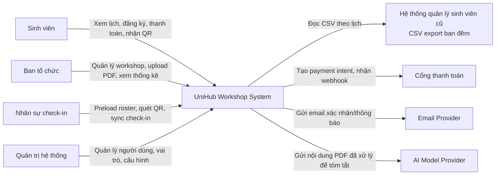
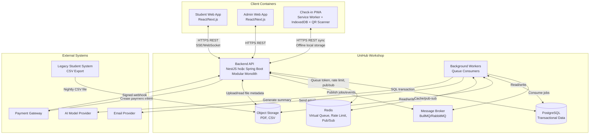
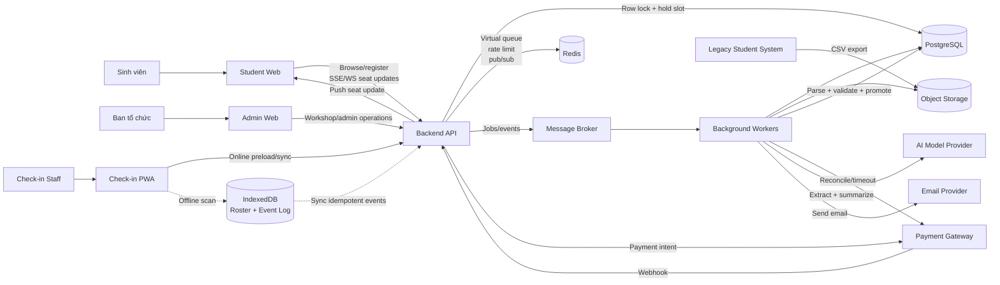
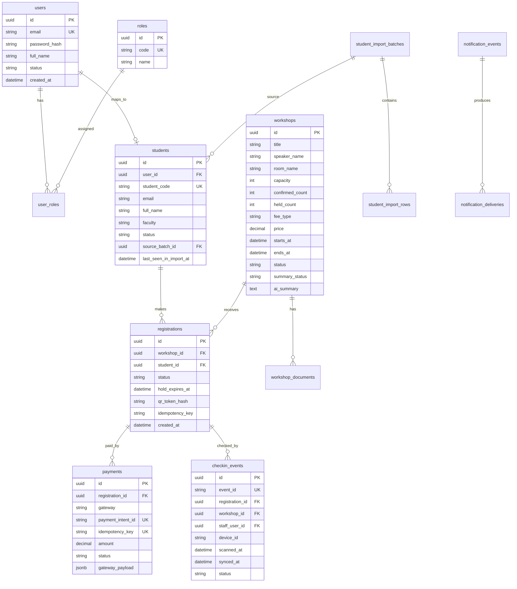

# UniHub Workshop - Technical Design

## Kiến trúc tổng thể

UniHub Workshop sử dụng kiến trúc **Modular Monolith + Background Workers**. Backend là một ứng dụng duy nhất, nhưng được chia thành các module nghiệp vụ độc lập: Auth/RBAC, Workshop, Registration, Payment, Notification, Check-in, Student Import, AI Summary và Realtime.

Các request cần phản hồi ngay được xử lý bởi Backend API. Các tác vụ tốn thời gian, dễ lỗi hoặc cần retry được đưa vào queue cho background workers xử lý, ví dụ gửi email, expire hold slot, payment reconcile, import CSV và tạo AI summary.

Lý do lựa chọn:

- Đơn giản hơn microservices trong phát triển và vận hành.
- Vẫn có boundary rõ ràng giữa các nghiệp vụ.
- Phù hợp nhóm nhỏ và bối cảnh đồ án/hệ thống trường đại học.
- Có thể mở rộng sau này bằng cách tách các module nặng như Payment, Notification hoặc AI thành service riêng.

Khi một phần gặp sự cố:

- Payment lỗi không làm hỏng xem lịch hoặc workshop miễn phí nhờ circuit breaker và graceful degradation.
- Email lỗi không làm rollback registration vì notification chạy async.
- AI lỗi chỉ làm summary chuyển `SUMMARY_FAILED`, workshop vẫn hoạt động.
- CSV lỗi bị reject ở staging, không ảnh hưởng bảng `students`.
- Mất mạng tại điểm check-in không làm mất dữ liệu vì PWA lưu event trong IndexedDB.

## C4 Diagram

### Level 1 - System Context

### Level 2 - Container

## High-Level Architecture Diagram

## Thiết kế cơ sở dữ liệu

### Lựa chọn database

Database chính là **PostgreSQL** vì hệ thống cần transaction mạnh, unique constraint, quan hệ dữ liệu rõ ràng và row-level locking để chống oversell. Redis được dùng cho dữ liệu tạm như virtual queue, rate limit, pub/sub realtime. Object storage lưu PDF và CSV.

Không chọn NoSQL làm database chính vì registration, payment và check-in cần tính nhất quán, audit và ràng buộc quan hệ tốt.

### Entity chính

### Ràng buộc schema quan trọng

- `workshops.confirmed_count + workshops.held_count <= workshops.capacity`.
- Unique partial index để một sinh viên chỉ có một registration active cho một workshop.
- `payments.payment_intent_id` và `payments.idempotency_key` là unique.
- `checkin_events.event_id` là unique để sync idempotent.
- Unique constraint logic theo `registration_id + workshop_id` cho check-in accepted để chống check-in nhiều lần.
- `student_import_batches.checksum` giúp phát hiện import trùng file.

## Thiết kế kiểm soát truy cập

Hệ thống dùng **RBAC đơn giản** với các role:

| Role | Quyền |
| --- | --- |
| `STUDENT` | Xem workshop, đăng ký, thanh toán, xem QR của chính mình |
| `ORGANIZER` | Tạo/sửa/hủy workshop, upload PDF, xem thống kê, quản lý import |
| `CHECKIN_STAFF` | Dùng Check-in PWA, preload roster, sync check-in event |
| `ADMIN` | Quản lý user/role/cấu hình, có toàn quyền organizer |

Backend enforce quyền tại API bằng middleware/guard. Frontend chỉ ẩn/hiện UI, không được xem là lớp bảo mật chính.

Ví dụ endpoint:

- `POST /registrations`: yêu cầu `STUDENT`.
- `POST /admin/workshops`: yêu cầu `ORGANIZER` hoặc `ADMIN`.
- `POST /checkin/preload`: yêu cầu `CHECKIN_STAFF` hoặc `ADMIN`.
- `POST /payment/webhook`: xác thực bằng chữ ký gateway, không dùng user role.

## Thiết kế các cơ chế bảo vệ hệ thống

### Kiểm soát tải đột biến

Giải pháp: **Virtual Queue + Token Bucket Rate Limiting + Idempotency**.

Virtual queue phát token theo nhịp kiểm soát để chỉ một lượng request hợp lệ đi vào registration API mỗi giây. Token gắn với `user_id`, `workshop_id`, `issued_at`, `expires_at` và chỉ dùng trong cửa sổ ngắn.

Rate limiting dùng Redis theo user/IP/endpoint. API chung dùng token bucket để cho phép burst nhỏ nhưng giới hạn tốc độ trung bình. Endpoint đăng ký dùng key chặt hơn theo `user_id + workshop_id`.

Khi vượt ngưỡng, API trả `429 Too Many Requests` và `Retry-After`.

### Xử lý cổng thanh toán không ổn định

Giải pháp: **Payment Adapter + Circuit Breaker + Graceful Degradation**.

Circuit breaker có ba trạng thái:

- **Closed:** gateway bình thường, request được gửi đi.
- **Open:** gateway lỗi vượt ngưỡng, hệ thống tạm ngừng gọi gateway.
- **Half-Open:** thử một số request nhỏ để kiểm tra phục hồi.

Khi circuit open, workshop miễn phí và chức năng xem lịch/admin vẫn hoạt động. Workshop có phí hiển thị thông báo thanh toán đang gián đoạn hoặc không cho tạo payment intent mới.

### Chống trừ tiền hai lần

Giải pháp: **Idempotency Key** ở registration và payment.

Frontend gửi `Idempotency-Key` khi sinh viên bấm đăng ký. Backend lưu key cùng registration. Nếu client retry với cùng key, backend trả lại registration/payment đã tạo trước đó.

Payment Module lưu `payments.idempotency_key` và `payment_intent_id` unique. Webhook handler cũng idempotent theo event ID/payment intent ID. Registration key giữ ít nhất 24 giờ; payment/webhook key giữ 7-30 ngày để phục vụ reconcile và khiếu nại.

## Các quyết định kỹ thuật quan trọng (ADR)

### ADR-001: Modular Monolith thay vì Microservices

Chọn modular monolith vì hệ thống có nhiều nghiệp vụ nhưng đội phát triển nhỏ, cần giảm độ phức tạp vận hành. Tradeoff là khó scale từng module độc lập hơn microservices, nhưng boundary module vẫn cho phép tách sau này.

### ADR-002: PostgreSQL là database chính

Chọn PostgreSQL vì registration/payment/check-in cần transaction, unique constraint và row-level lock. Redis chỉ dùng cho dữ liệu tạm và pub/sub.

### ADR-003: DB Row Lock + Hold Slot cho đăng ký

Chọn row lock để đảm bảo không oversell. Hold slot hỗ trợ workshop có phí và payment timeout. Tradeoff là workshop hot sẽ tuần tự hóa trên row lock, nhưng capacity nhỏ và transaction ngắn nên chấp nhận được.

### ADR-004: Virtual Queue + Rate Limit

Chọn virtual queue để bảo vệ API và tăng công bằng khi nhiều sinh viên vào cùng lúc. Rate limit chặn spam từ client/script.

### ADR-005: Async Payment Intent + Webhook

Chọn async payment để tránh request treo và xử lý chính xác trường hợp client timeout nhưng tiền đã bị trừ. Tradeoff là nhiều trạng thái hơn.

### ADR-006: Check-in PWA offline-first

Chọn PWA thay cho native mobile app để staff dễ truy cập và triển khai nhanh. Tradeoff là phụ thuộc browser/storage, nên cần preload, install PWA và IndexedDB event log.

### ADR-007: Notification Channel Adapter

Chọn Notification Module với adapter để thêm Telegram hoặc kênh mới mà không sửa Registration Module.

### ADR-008: Async AI Summary auto-publish

Chọn xử lý PDF/AI bằng worker, auto-publish summary với trạng thái `AI_GENERATED`. Admin có thể sửa sau thành `ADMIN_EDITED`.

### ADR-009: CSV Staging + Batch Audit

Chọn staging table và atomic promotion để file lỗi không làm hỏng bảng `students`. Batch audit giúp truy vết nguồn dữ liệu.

### ADR-010: SSE/WebSocket realtime seat updates

Chọn SSE/WebSocket để sinh viên thấy số chỗ gần thời gian thực. Tradeoff là vận hành nhiều kết nối phức tạp hơn polling.

