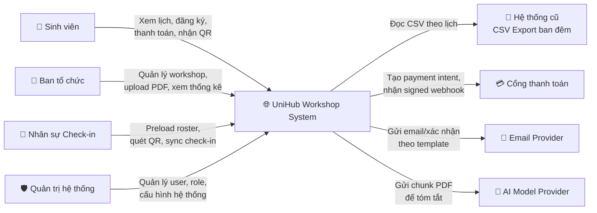
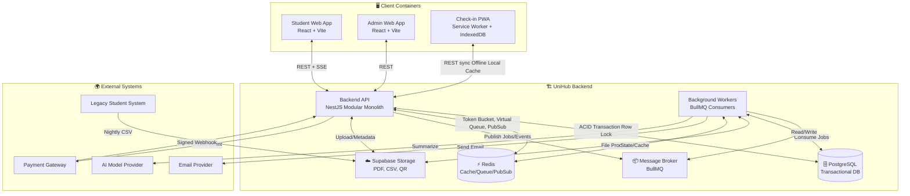
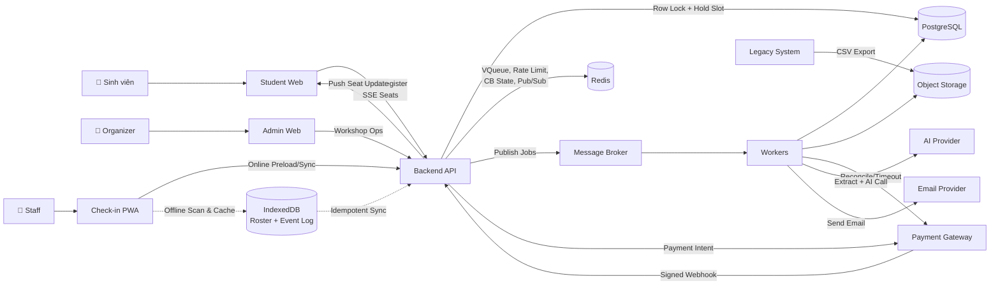
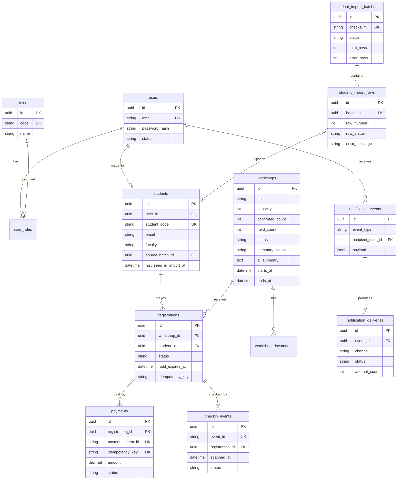

# UniHub Workshop — Technical Design

## 1. Kiến trúc tổng thể

UniHub Workshop sử dụng kiến trúc **Modular Monolith + Background Workers**. Toàn bộ backend được đóng gói trong một ứng dụng NestJS duy nhất, nhưng được phân tách rõ ràng theo ranh giới nghiệp vụ (Domain-Driven boundaries): `Auth/RBAC`, `Workshop`, `Registration`, `Payment`, `Notification`, `Check-in`, `Student Import`, `AI Summary` và `Realtime/Load Protection`.

### Thành phần & Giao tiếp
| Thành phần | Vai trò | Cơ chế giao tiếp |
|---|---|---|
| **Backend API** | Xử lý request đồng bộ, thực thi nghiệp vụ, RBAC, rate limit | REST + SSE (Server-Sent Events) |
| **Background Workers** | Xử lý tác vụ nặng/bất đồng bộ (email, AI, CSV, reconcile, expire hold) | BullMQ queues trên Redis |
| **PostgreSQL (Supabase)** | Source of truth cho dữ liệu nghiệp vụ, đảm bảo ACID | SQL transaction, row-level locking |
| **Redis (Docker)** | Cache, Virtual Queue, Token Bucket, Circuit Breaker state, Pub/Sub, JWT blocklist | `ioredis`, Lua scripts (atomic), TTL keys |
| **Object Storage** | Lưu PDF workshop, CSV legacy, QR image | HTTP REST API (Supabase Storage) |
| **Client Apps** | Student Web, Admin Web, Check-in PWA | HTTPS, IndexedDB (PWA offline), Service Worker |

### Tại sao chọn Modular Monolith?
- **Phù hợp quy mô nhóm & đồ án:** Giảm đáng kể độ phức tạp vận hành so với microservices (không cần service discovery, distributed tracing phức tạp, hay network latency management).
- **Biên giới nghiệp vụ rõ ràng:** Mỗi module tự quản lý repository và service, không gọi chéo trực tiếp DB của module khác. Giao tiếp liên module thông qua **Domain Events** và **Message Broker**.
- **Khả năng mở rộng tương lai:** Khi tải trọng tăng thực tế, các module nặng (Payment, Notification, AI) có thể tách ra thành microservices độc lập mà không cần viết lại nghiệp vụ.

### Mô hình chịu lỗi (Fault Isolation & Graceful Degradation)
Hệ thống được thiết kế theo nguyên tắc *"Fail safely, degrade gracefully"*. Khi một thành phần gặp sự cố, phần còn lại vẫn hoạt động:
| Thành phần lỗi | Hành vi hệ thống | Cơ chế bảo vệ |
|---|---|---|
| **Payment Gateway down** | Xem lịch & đăng ký miễn phí vẫn chạy. Đăng ký có phí trả `503`. | Circuit Breaker + Async Webhook |
| **Email Provider lỗi** | Registration vẫn `CONFIRMED`. Email retry độc lập theo channel. | Outbox Pattern + Channel Adapter |
| **AI Provider timeout** | Upload PDF thành công. Summary chuyển `SUMMARY_FAILED`, workshop vẫn hiển thị. | Async Worker + Retry Backoff + Status Flag |
| **Redis Pub/Sub lỗi** | Realtime số chỗ ngừng cập nhật UI. Đăng ký vẫn hoạt động bình thường. | DB Transaction là source of truth |
| **Mạng check-in mất** | Staff vẫn quét QR, lưu event local. Sync lại khi có mạng. | PWA Offline-first + IndexedDB + Idempotent Sync |
| **CSV lỗi/cú pháp sai** | Batch bị `REJECTED`. Bảng `students` không bị ảnh hưởng. | Staging Table + Atomic Promotion |

---

## 2. C4 Diagram

### Level 1 — System Context
Mô tả UniHub Workshop trong bức tranh tổng thể: người dùng trực tiếp và các hệ thống bên ngoài tích hợp.

### Level 2 — Container
Phân rã hệ thống thành các container công nghệ, thể hiện cách chúng giao tiếp và phụ thuộc lẫn nhau.

---

## 3. High-Level Architecture Diagram
Sơ đồ luồng dữ liệu chi tiết tại các điểm tích hợp trọng yếu, đặc biệt nhấn mạnh luồng **Check-in Offline** và **Payment Resilience**.

---

## 4. Thiết kế cơ sở dữ liệu

### Lựa chọn Database
Hệ thống sử dụng **PostgreSQL** làm cơ sở dữ liệu chính, kết hợp **Redis** cho dữ liệu tạm thời/trạng thái.
- **Tại sao không chọn NoSQL?** Các nghiệp vụ cốt lõi (Registration, Payment, Check-in) đòi hỏi tính nhất quán tuyệt đối (ACID), ràng buộc khóa ngoại, và row-level locking để chống oversell. NoSQL (MongoDB/DynamoDB) không đảm bảo được `confirmed_count + held_count ≤ capacity` ở cấp độ transaction một cách an toàn và dễ dàng như PostgreSQL.
- **Vai trò của Redis:** Chỉ dùng cho dữ liệu có TTL hoặc trạng thái biến động nhanh: Virtual Queue tokens, Token Bucket counters, Circuit Breaker state, SSE Pub/Sub channels, và JWT revocation list.

### Entity Relationship Diagram (Schema chính)

### Ràng buộc Schema quan trọng (Data Integrity)
| Ràng buộc | Mục đích | Cơ chế thực thi |
|---|---|---|
| `confirmed_count + held_count ≤ capacity` | Chống oversell tuyệt đối | Kiểm tra trong transaction + `SELECT FOR UPDATE` |
| Unique active registration per `(student_id, workshop_id)` | Một sinh viên không đăng ký trùng workshop | Partial unique index: `WHERE status IN ('CONFIRMED','PENDING_PAYMENT')` |
| `payments.payment_intent_id` UNIQUE | Chống tạo nhiều intent cho 1 registration | Database constraint |
| `payments.idempotency_key` UNIQUE | Chống double charge khi retry | Database constraint |
| `checkin_events.event_id` UNIQUE | Sync offline idempotent, tránh trùng check-in | Database constraint |
| `student_import_batches.checksum` UNIQUE | Phát hiện & bỏ qua file CSV đã import | Database constraint |
| `notification_deliveries` UNIQUE `(event_id, channel)` | Tránh gửi trùng email/in-app | Database constraint |

---

## 5. Thiết kế kiểm soát truy cập

### Mô hình RBAC (Role-Based Access Control)
Hệ thống phân quyền theo 4 vai trò cố định, enforce **100% tại Backend**.
| Role | Quyền hạn nghiệp vụ | Endpoint tiêu biểu |
|---|---|---|
| `STUDENT` | Xem lịch, đăng ký, thanh toán, xem QR của chính mình | `POST /registrations`, `GET /me/registrations` |
| `ORGANIZER` | Tạo/sửa/hủy workshop, upload PDF, xem thống kê, quản lý import | `POST /admin/workshops`, `POST /admin/workshops/:id/documents` |
| `CHECKIN_STAFF` | Preload roster, quét QR, sync check-in | `POST /checkin/preload`, `POST /checkin/sync` |
| `ADMIN` | Quản lý user/role/cấu hình, có toàn quyền của Organizer | `POST /admin/users/:id/roles` |

### Cơ chế Token & Session
- **Access Token:** JWT, TTL `15 phút`. Lưu trong memory client. Gửi qua `Authorization: Bearer <token>`.
- **Refresh Token:** JWT, TTL `7 ngày`. Lưu trong `HTTP-only cookie`. Cơ chế **Rotation**: mỗi lần refresh sẽ phát cặp token mới, đồng thời revoke token cũ bằng cách lưu `jti` vào Redis blocklist (TTL = thời gian còn lại của token cũ).
- **Bảo mật mật khẩu:** Hash bằng `bcrypt` với `cost factor ≥ 12`. Tuyệt đối không lưu plaintext hoặc MD5/SHA-1.

### Điểm kiểm tra quyền (Enforcement Points)
1. **API Endpoints:** `JwtAuthGuard` → xác thực token → `RolesGuard` → kiểm tra `roles[]` trong payload. Frontend chỉ ẩn UI, **không được coi là ranh giới bảo mật**.
2. **Payment Webhook:** Không dùng JWT/RBAC. Xác thực bằng **HMAC-SHA256 signature** từ shared secret với gateway.
3. **Ownership Check:** Ngoài role, backend kiểm tra `student_id == token.user_id` trước khi trả về dữ liệu cá nhân hoặc QR code.
4. **Audit Logging:** Ghi log tất cả thao tác nhạy cảm: login, role change, workshop create/cancel, token revoke, admin config changes.

---

## 6. Thiết kế các cơ chế bảo vệ hệ thống

### 6.1. Kiểm soát tải đột biến (Load Protection)
**Bài toán:** 12.000 sinh viên truy cập cùng lúc, 60% tập trung trong 3 phút đầu. Backend dễ bị sập nếu xử lý đồng thời toàn bộ request đăng ký.

**Giải pháp 3 lớp:** `Virtual Queue` → `Token Bucket Rate Limiting` → `DB Transaction + Idempotency`.

#### A. Token Bucket Rate Limiting
- **Thuật toán chọn:** Token Bucket (cho phép burst nhỏ hợp lệ, phân phối đều, phù hợp hành vi mở trang đồng loạt).
- **Triển khai:** Redis lưu `(tokens, last_refill_ts)`. Mỗi request kiểm tra nguyên tử bằng Lua Script. Nếu `tokens > 0` → giảm 1, cho qua. Nếu `0` → trả `429 Too Many Requests` + header `Retry-After`.
- **Cấu hình theo Tier:**
| Endpoint | Key | Burst | Refill Rate | Hành vi vượt ngưỡng |
|---|---|---|---|---|
| Xem lịch (public) | `ip` | 60 | 10/s | `429` + `Retry-After: 5s` |
| Đăng nhập | `ip` | 10 | 1/s | `429` + `Retry-After: 10s` |
| **Đăng ký workshop** | `user_id + workshop_id` | 5 | 1/30s | `429` + `Retry-After: 30s` |
| Admin thao tác | `user_id` | 30 | 5/s | `429` + `Retry-After: 5s` |

#### B. Virtual Queue
- **Cơ chế:** Trước khi gọi `POST /registrations`, client phải xin token qua `POST /workshops/:id/queue-token`.
- **Redis lưu:** `qt:{user_id}:{workshop_id}` với payload `{issued_at, expires_at}`. TTL = `120 giây`.
- **Luồng:** Backend chỉ chấp nhận registration request nếu token tồn tại, đúng user/workshop. Ngay sau khi dùng thành công, token bị `DEL` khỏi Redis (one-time-use). Nếu hết hạn, client phải xin lại (quay hàng đợi).
- **Lợi ích:** Biến bài toán "chống DDOS tự nhiên" thành bài toán "luồng có kiểm soát", bảo vệ DB khỏi bị flood transaction cùng lúc.

#### C. Idempotency Key
- Client sinh UUID v4 khi bấm "Đăng ký", gửi qua header `Idempotency-Key`.
- Backend kiểm tra DB: nếu key đã tồn tại trong 24h → trả kết quả cũ, không tạo registration mới.
- Ngăn chặn hiệu ứng "double-click" hoặc network timeout retry gây oversell.

### 6.2. Xử lý cổng thanh toán không ổn định
**Bài toán:** Payment gateway có thể timeout, giới hạn kết nối, hoặc down hoàn toàn. Nếu không cô lập, lỗi sẽ kéo sập toàn bộ API.

**Giải pháp:** `Circuit Breaker Pattern` + `Async Webhook` + `Graceful Degradation`.

#### A. Circuit Breaker State Machine
Lưu trạng thái tại Redis key `cb:payment_gateway`.
| Trạng thái | Mô tả | Điều kiện chuyển |
|---|---|---|
| **Closed** | Hoạt động bình thường | → **Open** khi: ≥ 5 lỗi liên tiếp trong 30s HOẶC tỉ lệ lỗi > 50% trong cửa sổ 30s (min 10 req) |
| **Open** | Từ chối ngay mọi request mới, trả `503` | → **Half-Open** sau 30s timeout |
| **Half-Open** | Cho qua tối đa 3 request thăm dò (probe) | → **Closed** nếu 3 probe đều thành công. → **Open** nếu bất kỳ probe nào lỗi |

#### B. Graceful Degradation khi Circuit Open
| Chức năng | Trạng thái hoạt động | Lý do |
|---|---|---|
| Xem lịch / Chi tiết workshop | ✅ Bình thường | Không phụ thuộc gateway |
| Đăng ký workshop miễn phí | ✅ Bình thường | Không gọi gateway |
| Đăng ký workshop có phí | ⚠️ `503 Service Unavailable` | Ngăn user bị treo ở trang thanh toán ảo |
| Webhook inbound từ gateway | ✅ Vẫn xử lý | Webhook là đường vào độc lập, không đi qua CB |

#### C. Xử lý Timeout & Client Disconnect
- API gọi gateway với timeout cứng `5 giây`. Vượt quá → tính là lỗi, tăng counter CB.
- Nếu client browser timeout nhưng gateway đã trừ tiền thành công → **Webhook vẫn gửi về backend**. Backend xác thực chữ ký → cập nhật `payment SUCCEEDED` → chuyển registration `CONFIRMED`. User không cần thanh toán lại.

### 6.3. Chống trừ tiền hai lần (Idempotent Payment)
**Bài toán:** Network retry, user bấm nhiều lần, hoặc webhook gửi trùng từ gateway.

**Giải pháp:** `Idempotency Key` ở 3 tầng.
1. **Registration Intent:** `payments.idempotency_key` là UNIQUE constraint. Retry cùng key trả về `payment_intent_id` cũ.
2. **Payment Intent ID:** `payments.payment_intent_id` UNIQUE. Webhook handler check `payment_intent_id` trước khi update. Nếu đã `SUCCEEDED` → trả `200 OK` ngay, không cập nhật seat count.
3. **Hold Slot Expiration:** Worker chạy định kỳ (hoặc delayed job 10 phút). Nếu `hold_expires_at` hết mà payment chưa `SUCCEEDED` → chuyển registration `EXPIRED`, giảm `held_count`, slot được trả lại.
4. **Auto-Refund (Edge Case):** Nếu webhook `SUCCEEDED` đến SAU khi registration đã `EXPIRED` → hệ thống tự động gọi `PaymentAdapter.refund()` với idempotency key riêng, chuyển registration sang `NEEDS_REVIEW` để admin xử lý.

---

## 7. Các quyết định kỹ thuật quan trọng (ADR)

| Mã | Quyết định | Lý do chọn | Trade-off / Rủi ro | Giải pháp giảm thiểu |
|---|---|---|---|---|
| **ADR-01** | **Modular Monolith** thay vì Microservices | Nhóm 3 người, đồ án học thuật. Giảm overhead deploy, monitoring, distributed tracing. Boundary rõ ràng qua Domain Events. | Khó scale độc lập từng module khi tải cực lớn. | Thiết kế module decoupled, dùng BullMQ/Redis. Có thể tách Payment/Notification thành service riêng sau này. |
| **ADR-02** | **PostgreSQL** làm DB chính, **không dùng NoSQL** | Registration/Payment/Check-in cần ACID, row lock, constraint chặt chẽ. Chống oversell bắt buộc phải có transaction atomic. | NoSQL scale ngang tốt hơn nhưng không đảm bảo consistency cho bài toán seat counting. | Dùng connection pooling, read replica (nếu cần), tối ưu index. Giữ dữ liệu tạm ở Redis. |
| **ADR-03** | **`SELECT FOR UPDATE` + Hold Slot** thay vì Optimistic Locking | Capacity workshop nhỏ (~60-200). Row lock đơn giản, đảm bảo 100% không oversell khi tranh chấp cao. Optimistic lock dễ fail retry gây trải nghiệm tệ. | Tuần tự hóa request trên cùng workshop row, có thể giảm throughput. | Transaction giữ lock cực ngắn (<50ms), không gọi I/O ngoài trong transaction. Hold slot giải phóng chỗ nhanh. |
| **ADR-04** | **Token Bucket + Virtual Queue** | Token Bucket cho phép burst hợp lệ khi mở đăng ký. Virtual Queue điều tiết luồng request vào DB, biến đồng thời thành tuần tự có kiểm soát. | Cần Redis ổn định. Logic phức tạp hơn Fixed Window. | Dùng Lua script atomic trên Redis. Fallback: nếu Redis down, rate limit vô hiệu nhưng DB transaction vẫn bảo vệ oversell. |
| **ADR-05** | **Async Payment Intent + Signed Webhook** | Đồng bộ payment dễ timeout, treo request, gây double charge nếu user retry. Webhook là chuẩn công nghiệp, đảm bảo trạng thái cuối cùng chính xác. | Nhiều trạng thái trung gian (`PENDING_PAYMENT`, `INITIATED`). Cần worker reconcile. | Circuit breaker cô lập lỗi. Reconcile worker quét stale payment mỗi 15 phút. Hold slot tự expire. |
| **ADR-06** | **Check-in PWA Offline-first** thay vì Native App | Triển khai nhanh, cross-platform, không cần App Store review. Service Worker + IndexedDB hỗ trợ offline mạnh. | Phụ thuộc browser storage. Safari iOS có thể xóa cache nếu không cài PWA. | Bắt buộc HTTPS. Yêu cầu staff "Add to Home Screen". Sync idempotent qua `event_id` UUID. |
| **ADR-07** | **Notification Outbox + Channel Adapter** | Business module không nên gọi trực tiếp email/Telegram. Outbox đảm bảo event không mất nếu worker crash. Adapter dễ mở rộng kênh mới. | Thêm độ trễ nhẹ so với gửi đồng bộ. Cần bảng `notification_events` & `deliveries`. | Worker xử lý async, retry per channel độc lập. Business transaction commit trước khi ghi outbox. |
| **ADR-08** | **SSE + Redis Pub/Sub** thay vì Supabase Realtime/WebSocket | Supabase Realtime bypass backend API (vi phạm boundary), free tier giới hạn 200 connection. SSE một chiều, nhẹ, phù hợp seat update. | SSE không hỗ trợ client→server message. Cần duy trì nhiều connection dài. | Chỉ dùng cho seat count. Client reconnect tự động. Redis Pub/Sub phân tán update qua nhiều API instance. |
| **ADR-09** | **CSV Staging Table + Atomic Promotion** | Import trực tiếp vào bảng `students` dễ gây corrupt data nếu file lỗi hoặc worker crash giữa chừng. | Cần thêm bảng `student_import_rows` và `batches`. Tốn dung lượng lưu log. | Promotion trong 1 transaction. Nếu fail → rollback toàn bộ. Checksum chống import trùng file. |
| **ADR-10** | **JWT Stateless + Refresh Rotation + Redis Blocklist** | JWT stateless scale ngang dễ dàng. Không cần session store chung. Rotation giảm rủi ro token bị đánh cắp. | JWT không thể revoke trước hạn nếu không có blocklist. | Lưu `jti` token cũ vào Redis với TTL = thời gian còn lại. Access TTL ngắn (15m) giảm cửa sổ tấn công. |

---
*Tài liệu này được thiết kế để làm rõ ranh giới kiến trúc, cơ chế chịu lỗi phi chức năng và các ràng buộc kỹ thuật then chốt. Mọi luồng nghiệp vụ chi tiết, kịch bản lỗi và tiêu chí chấp nhận được đặc tả đầy đủ trong thư mục `specs/`.*