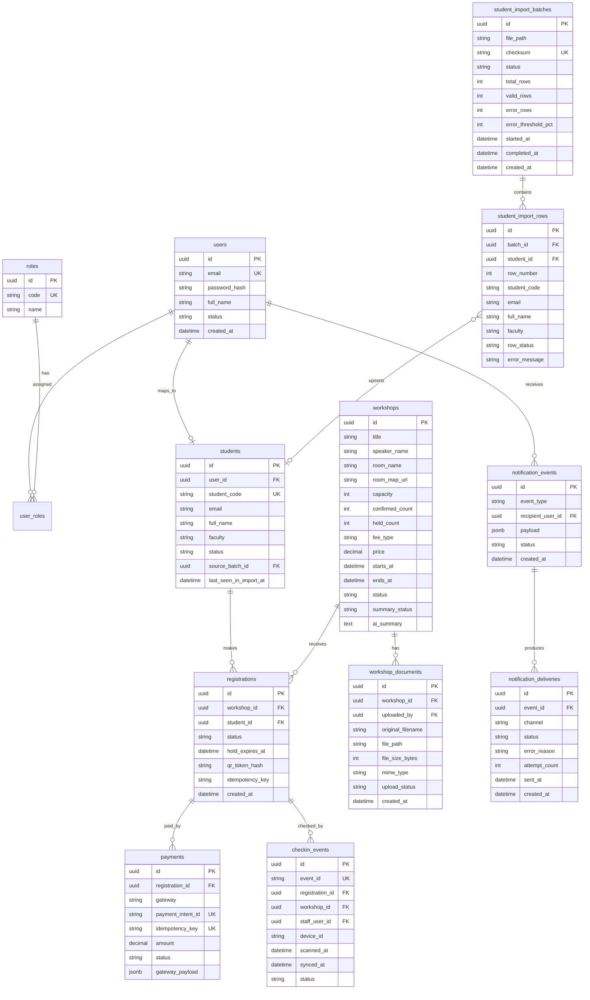

## Context

UniHub Workshop is a greenfield system that digitizes the "Skills and Career Week" event at University A. The system serves ~12,000 students and three user groups (Student, Organizer, Check-in Staff + Admin), with real technical challenges: seat contention, traffic spikes, unstable payment gateway, offline check-in, and one-way CSV integration with the legacy student system.

Team size: 3 developers. Greenfield. Academic project timeline. Prioritize correctness of patterns over production-grade infrastructure.

## Goals / Non-Goals

**Goals:**
- Implement all 9 capabilities in priority order: auth-rbac → workshop-catalog → registration → load-protection → payment → notification → checkin-pwa → student-import → ai-summary.
- Clearly demonstrate key technical patterns: row lock, token bucket, circuit breaker, idempotency, pipe-and-filter, batch sequential, channel adapter, offline-first.
- Monorepo (pnpm): 1 NestJS API + 3 React/Vite apps + 1 shared types package.
- Use Supabase (PostgreSQL + Storage) and Redis 7 Docker (cache / queue / rate-limit / SSE pub/sub).

**Non-Goals:**
- Real payment gateway (Stripe / VNPay / MoMo) — using mock adapter.
- Native mobile app — Check-in uses PWA.
- SSO with the university's identity system — self-managed email/password auth.
- Kubernetes / autoscaling / full observability dashboard.
- Admin-configurable notification rule engine.
- Scoped check-in permissions per room — simple RBAC is sufficient.

## Decisions

### D1: pnpm Monorepo Workspaces
**Decision:** Single repository, pnpm workspaces, 5 packages: `apps/api`, `apps/student-web`, `apps/admin-web`, `apps/checkin-pwa`, `packages/shared`.
**Rationale:** Small team; sharing types between FE and BE is straightforward without publishing packages. `packages/shared` holds DTOs, enums, and constants.
**Alternative considered:** Separate repos — excessive management overhead for 3 developers.

### D2: NestJS Modular Monolith
**Decision:** NestJS backend; each capability maps to one NestJS module. Workers run in-process via BullMQ.
**Rationale:** Clear module boundaries, decorator-based guards for clean RBAC enforcement, BullMQ integrates naturally. Team is familiar with TypeScript.
**Alternative considered:** Express/Fastify — less structure, harder to enforce module boundaries.

### D3: SSE + Redis Pub/Sub for Realtime Seat Updates
**Decision:** Use a custom SSE endpoint `GET /workshops/:id/seats` on NestJS. When seat count changes (registration/hold/expire), Backend publishes to Redis Pub/Sub channel `ws:{workshop_id}:seats`. All API instances subscribe and push updates to connected SSE clients.
**Rationale:** Supabase Realtime (Postgres Changes) lets the frontend subscribe directly to DB changes, bypassing the backend API entirely — this violates the architectural boundary. Additionally, the free tier caps at 200 concurrent connections, insufficient for 12,000 users. SSE is one-directional (server → client) which is exactly what seat count requires.
**Limitation:** SSE does not support bidirectional communication — not needed for this use case.

### D4: Redis 7 Docker for Rate Limiting, Queue Tokens, Circuit Breaker, JWT Blocklist, BullMQ
**Decision:** Use self-hosted Redis 7 via Docker Compose. BullMQ, Token Bucket, Virtual Queue, Circuit Breaker, JWT Blocklist, and SSE Pub/Sub all connect via `ioredis`.
**Rationale:** BullMQ requires a native Redis connection (`ioredis`). Running Redis locally via Docker is simpler, more reliable, and eliminates external service dependency for the queue/cache layer. A single `docker-compose up` starts the only required local infrastructure.
**Note:** Token bucket stores `(tokens, last_refill_ts)` per Redis key. Circuit breaker stores state key with TTL.

### D5: Mock Payment Gateway
**Decision:** Implement `MockPaymentAdapter` in the Payment module. A mock checkout endpoint `POST /mock-payment/pay/:intentId` simulates payment success/failure. Webhook is sent to the same API.
**Rationale:** No real payment gateway available. The pattern is fully preserved: adapter interface, circuit breaker, idempotency key, HMAC webhook signature verification (fixed secret). Each gateway call has a **5-second timeout** — exceeding it counts as a failure for the circuit breaker.
**Auto-refund:** When hold expires and a webhook arrives late with SUCCEEDED status → refund worker calls `MockPaymentAdapter.refund()` with an idempotency key.

### D6: JWT Stateless + Redis Blocklist
**Decision:** Access token: JWT, 15-min TTL, stored in memory. Refresh token: JWT, 7-day TTL, stored in HTTP-only cookie. Rotated on every refresh; old token revoked by storing `jti` in Redis with TTL = remaining lifetime.
**Rationale:** Stateless tokens scale across multiple API instances. Refresh token rotation mitigates token theft. Blocklist only holds revoked `jti` values, keeping it small.

### D7: Signed QR Token — HMAC-SHA256, TTL = end_time + 30 min
**Decision:** QR payload: `registrationId + workshopId + studentId + expiresAt`. Signed with HMAC-SHA256 using a server secret. Check-in PWA verifies the signature offline using the preloaded secret.
**Rationale:** A signed QR cannot be forged offline. TTL = workshop end_time + 30 minutes provides a buffer for staff to process the last attendees.

### D8: Student Validation on Registration
**Decision:** Before creating a registration, the Registration module checks that `students.user_id = current_user.id` and `students.status = ACTIVE`. If no record exists → return `STUDENT_NOT_VERIFIED` error.
**Rationale:** Requirements explicitly state "verify students at registration time" — only students imported via CSV are allowed to register.
**Implication:** Students must be imported before they can register. Flow: CSV import → student record created → user creates account with matching email → `students.user_id` is linked.

### D9: Workshop Change Notifications
**Decision:** When an Organizer calls `PATCH /admin/workshops/:id` (room or time change) or `POST /admin/workshops/:id/cancel`, the Workshop module emits a `WorkshopUpdated` or `WorkshopCancelled` domain event. The Notification module consumes the event and notifies all students with a `CONFIRMED` or `PENDING_PAYMENT` registration for that workshop.
**Rationale:** Requirements mention room changes, time changes, and cancellations. Students who have already registered need to be informed to adjust their schedules.

### D10: Check-in PWA — Staff Selects Workshop to Preload
**Decision:** The first screen of the Check-in PWA lists workshops currently in progress or about to start. Staff selects one workshop → PWA preloads its roster (registrationId, studentId, qr_token_hash) and the HMAC secret into IndexedDB.
**Rationale:** Preloading only the selected workshop reduces data transfer and keeps the PWA focused on the workshop being staffed.

### D11: Supabase as Managed Infrastructure (PostgreSQL + Storage only)
**Decision:** Use Supabase exclusively as a PostgreSQL host and Object Storage provider. Do NOT use Supabase Auth or Supabase Realtime.
**Rationale:** Prisma connects to Supabase PostgreSQL via `DATABASE_URL` — zero code change compared to a local Docker PostgreSQL. Supabase Storage replaces MinIO, eliminating one Docker container. Supabase Auth conflicts with the custom JWT/RBAC system (D6). Supabase Realtime bypasses the backend API and has connection limits (D3).
**Trade-off:** Depends on Supabase availability for DB and storage; acceptable for an academic project.

## Data Model

The system uses PostgreSQL as the primary database, managed via Prisma ORM.

### Entity Relationship Diagram



### Key Schema Constraints

- **Capacity limit:** `workshops.confirmed_count + workshops.held_count <= workshops.capacity`.
- **One registration per student per workshop:** Unique partial index to ensure a student has only one active registration per workshop (excluding `CANCELLED`, `EXPIRED`).
- **Idempotency:** `payments.payment_intent_id` and `payments.idempotency_key` are unique. `checkin_events.event_id` is unique for idempotent sync.
- **Prevent duplicate check-ins:** Unique constraint logic by `registration_id + workshop_id` for accepted check-ins to prevent multiple scans.
- **Prevent duplicate imports:** `student_import_batches.checksum` is unique to detect duplicate file uploads.
- **Prevent duplicate notifications:** `notification_deliveries` unique by `(event_id, channel)` to avoid sending the same notification twice on the same channel.

## Risks / Trade-offs

- **Redis Docker single point of failure** → Mitigated by Docker volume persistence and AOF (append-only file). For an academic project, this is acceptable.
- **Supabase Storage free tier** → 1 GB storage limit. Sufficient for academic project (PDF uploads + QR images + CSV files).
- **Student–User linking** → Email must match between the CSV and the registered account. If a student uses a different email, the link will fail. The UI must surface a clear error message.
- **Mock payment** → Circuit breaker pattern is fully demonstrated, but mock latency won't reflect real gateway behavior. Artificial delay (configurable) is injected in the mock adapter to simulate real-world timeouts.
- **PWA offline storage** → IndexedDB has good support on Chrome/Edge but limited persistence on Safari iOS. Installing the PWA is required for reliable persistent storage.
- **AI API cost** → OpenAI/Gemini charges per token. The 20 MB file limit and 3,000-token chunk cap keep costs bounded for an academic project.

## Module Structure

```
src/
├── auth/             # JWT, RBAC guard, session
├── workshop/         # CRUD workshop, SSE seat count
├── registration/     # Hold slot, QR generation
├── payment/          # Circuit breaker, idempotency, webhook
├── checkin/          # Preload roster, offline sync
├── notification/     # Channel adapter (email, push, Telegram stub)
├── student-import/   # CSV staging, validation, promotion
├── ai-summary/       # PDF parse, LLM call
├── queue/            # BullMQ setup, worker definitions
└── common/           # Rate limiter, virtual queue, response utils
```

## Typical Request Flow — Paid Workshop Registration

```
Client
  │
  │  POST /registrations
  │  Headers: Authorization: Bearer <jwt>
  │           Idempotency-Key: <uuid4>
  │           X-Queue-Token: <token>
  ▼
[JWT Guard]  →  validate token, extract user_id + role
  │
[RBAC Guard]  →  check role = STUDENT
  │
[Rate Limit Guard]  →  Token Bucket Redis
  │                    key: rl:{user_id}:register
  │                    5 tokens, refill 1/30s
  │
[Idempotency Interceptor]  →  lookup DB by Idempotency-Key
  │                            if exists → return previous result
  │
[Registration Service]
  │
  ├─ BEGIN TRANSACTION
  │    SELECT * FROM workshops WHERE id = ? FOR UPDATE
  │    Check: status=OPEN, held+confirmed < capacity
  │    INSERT registration (status=PENDING_PAYMENT, hold_expires_at=now+10m)
  │    UPDATE workshops SET held_count = held_count + 1
  │  COMMIT
  │
  ├─ [Payment Adapter]
  │    [Circuit Breaker] → if OPEN → 503 "Thanh toán tạm gián đoạn"
  │    if CLOSED → call gateway to create payment intent (with idempotency key, 5s timeout)
  │    return payment_url to client
  │
  └─ Enqueue BullMQ jobs:
       - hold-expire (delay 10m): if not paid → cancel registration

Client → redirect to payment_url → pay on gateway

Gateway → POST /payment/webhook (signed)
  │
  ├─ Verify webhook HMAC signature
  ├─ BEGIN TRANSACTION
  │    UPDATE payments SET status=SUCCEEDED
  │    UPDATE registrations SET status=CONFIRMED, qr_token=<hash>
  │    UPDATE workshops SET held_count-1, confirmed_count+1
  │  COMMIT
  │
  └─ Enqueue:
       - notification:send → email (Resend) + in-app
       - qr:generate → generate QR image → save to Supabase Storage
```

## Redis Key Patterns

| Purpose | Key Pattern | TTL |
|---|---|---|
| Rate limit (Token Bucket) | `rl:{user_id}:{endpoint}` | 60s |
| Virtual queue token | `qt:{user_id}:{workshop_id}` | 120s |
| Circuit breaker state | `cb:payment_gateway` | Self-managed |
| JWT blocklist (revoked jti) | `jti:{jti}` | Remaining token lifetime |
| BullMQ job queues | `bull:{queue_name}:*` | — |
| SSE pub/sub | `ws:{workshop_id}:seats` | — |

## Object Storage (Supabase Storage)

| File type | Bucket | Note |
|---|---|---|
| Workshop PDF | `workshop-docs` | Uploaded by organizer; worker reads to extract text |
| Student CSV | `student-imports` | Legacy system writes here nightly |
| QR image | `qr-codes` | Worker generates after registration CONFIRMED |

## RBAC — Endpoint Map

| Endpoint | Method | Required Role |
|---|---|---|
| `/workshops` | GET | Public |
| `/workshops/:id` | GET | Public |
| `/workshops/:id/seats` | GET (SSE) | Public |
| `/registrations` | POST | STUDENT |
| `/registrations/:id` | GET | STUDENT (own only) |
| `/admin/workshops` | POST/PUT/DELETE | ORGANIZER, ADMIN |
| `/admin/workshops/:id/documents` | POST | ORGANIZER, ADMIN |
| `/admin/workshops/:id/stats` | GET | ORGANIZER, ADMIN |
| `/admin/imports` | GET/POST | ORGANIZER, ADMIN |
| `/admin/users` | GET/PUT | ADMIN |
| `/checkin/preload/:workshopId` | GET | CHECKIN_STAFF, ADMIN |
| `/checkin/sync` | POST | CHECKIN_STAFF, ADMIN |
| `/payment/webhook` | POST | (gateway signature) |

Example guard enforcement pattern:

```
POST /registrations
  requires: STUDENT role
  guards: JwtAuthGuard → RolesGuard → RateLimitGuard

POST /admin/workshops
  requires: ORGANIZER or ADMIN role
  guards: JwtAuthGuard → RolesGuard

POST /payment/webhook
  no role required — authenticated by HMAC signature
  guards: WebhookSignatureGuard
```

## Background Workers (BullMQ)

All workers run in-process within NestJS, consuming from Redis queues via BullMQ.

| Queue | Job | Trigger | Processing |
|---|---|---|---|
| `notification` | `send` | After CONFIRM / workshop change event | Calls channel adapter (email/in-app/Telegram stub) |
| `ai-summary` | `process-pdf` | After organizer uploads PDF | Extract text → call LLM → save summary |
| `csv-import` | `process-batch` | Scheduler detects new file | Parse → staging → validate → promote |
| `payment` | `reconcile` | Cron every 15 minutes | Check PENDING payments older than 30 min |
| `hold-expire` | `expire` | Delayed 10 min after registration creation | Cancel PENDING_PAYMENT → decrement held_count |

**Retry policy:**
- Notification: 5 attempts, exponential backoff (immediate → 1m → 5m → 30m → 2h → `FAILED_PERMANENT`)
- AI summary: 3 attempts, exponential backoff (1m → 5m → 15m)
- CSV import: no auto-retry; admin triggers manually
- Hold expire: no retry (idempotent — checks status before cancelling)

## Check-in Offline Flow

### Preparation (online)
1. Staff logs in with `CHECKIN_STAFF` account, selects the workshop to staff.
2. PWA calls `GET /checkin/preload/:workshopId`.
3. Backend returns all CONFIRMED registrations (registrationId, studentId, qr_token_hash) + HMAC secret.
4. PWA saves to IndexedDB (roster + HMAC secret).

### Offline Scan
1. Staff scans QR → PWA decodes QR token.
2. PWA verifies HMAC signature offline using the preloaded secret.
3. Looks up IndexedDB: checks registration is valid and not yet checked-in locally.
4. Writes `checkin_event` to IndexedDB with `event_id = uuid4()`, `status = PENDING_SYNC`.
5. Shows result to staff immediately.

### Sync (when back online)
1. PWA sends `POST /checkin/sync` with a batch of unsynced events.
2. Backend upserts by `event_id` (UNIQUE constraint) → idempotent.
3. Backend returns per-event result (ACCEPTED / DUPLICATE / INVALID).
4. PWA updates IndexedDB accordingly.

**Edge cases:**
- PWA closed while offline → events remain in IndexedDB, sync when reopened.
- Two devices scan the same QR offline → server accepts first event (ACCEPTED), second is DUPLICATE.
- Expired QR → HMAC verification fails at PWA; rejected without needing network.

## CSV Import Pipeline

```
Legacy system
  │  export students.csv → Supabase Storage (student-imports bucket)
  ▼
Scheduler (cron 2:00 AM)
  │  Detect new file via checksum
  │  If checksum already exists → skip
  ▼
student-import Worker
  │  Parse CSV → insert student_import_rows (staging)
  │  Validate: valid header, required fields, format
  │  Count errors: if error_rate > threshold (default 20%) → REJECTED
  ▼
  │  Promotion (if valid)
  │  BEGIN TRANSACTION
  │    UPSERT students ON CONFLICT (student_code) DO UPDATE
  │    Update source_batch_id, last_seen_in_import_at
  │  COMMIT
  │  Batch → status = PROMOTED
  ▼
Admin views import report (total rows, errors, duplicates)
```

- Import runs on background worker — does not block API.
- Staging table is separate from `students` → file errors cannot corrupt production data.
- Atomic promotion → if worker dies mid-promotion, transaction rolls back and retry is safe.

## SSE Seat Count — Edge Cases

- **SSE disconnects:** Client auto-reconnects (`EventSource` auto-retry) and fetches current snapshot via `GET /workshops/:id`.
- **Redis pub/sub failure:** API continues processing registrations via DB; realtime degrades gracefully (no seat count push) but core functionality is unaffected.
- **Realtime count is NOT source of truth** — the DB transaction is the final authority on capacity.

```
GET /workshops/:id/seats  (SSE)
  → subscribe to Redis Pub/Sub channel ws:{workshopId}:seats
  → on event received: push { remaining_seats, held_count, confirmed_count } to SSE client
  → on client disconnect: unsubscribe from Redis channel
```

## Notification — Event Mapping & Channel Adapter

| Domain Event | Template | Channels | Trigger |
|---|---|---|---|
| `RegistrationConfirmed` (free) | `registration_confirmed` | email (Resend), in-app | Registration Module |
| `PaymentSucceeded` | `registration_confirmed` | email (Resend), in-app | Payment Module |
| `RegistrationExpired` | `registration_expired` | in-app | Hold Expire Worker |
| `WorkshopCancelled` | `workshop_cancelled` | email (Resend), in-app | Organizer Admin |
| `WorkshopUpdated` (room/time) | `workshop_updated` | email (Resend), in-app | Organizer Admin |
| `PaymentFailed` | `payment_failed` | in-app | Payment Module |

```
RegistrationService.confirmRegistration(reg):
  → write NotificationEvent { type: RegistrationConfirmed, recipient, payload } to DB (outbox)

NotificationWorker.processEvent(event):
  → resolve channels for event.type  (e.g. [email, in-app])
  → for each channel:
      create NotificationDelivery { event_id, channel, status: PENDING }
      enqueue BullMQ job: notification:send { delivery_id, channel }

ChannelAdapter interface:
  send(recipient, payload) → void
  Implementations: EmailChannel (Resend SDK) | InAppChannel | TelegramChannel (stub)
```

To add Telegram: implement `TelegramChannel` + add channel to the mapping table. No changes needed in Registration, Payment, or any other business module.

## AI Summary — Technical Constraints & Pipeline

| Parameter | Value |
|---|---|
| Max PDF size | 20 MB |
| Accepted format | `application/pdf` only |
| Chunk size | ≤ 3,000 tokens/chunk |
| AI call timeout | 30 seconds/call |
| Max retries | 3 (backoff: 1m → 5m → 15m) |
| Min output length | 100 characters |

**Pipeline:**

```
Organizer uploads PDF (≤ 20 MB)
  │  Backend validates mime_type + size → if > 20 MB → 413
  │  Save to Supabase Storage (workshop-docs bucket)
  │  Create workshop_document (upload_status = UPLOADED)
  │  Enqueue BullMQ job: ai-summary:process-pdf
  │  Return 201 immediately (no wait for AI)
  ▼
AI Summary Worker
  │  Extract text (pdf-parse / pdfplumber)
  │  Clean text (remove repeated headers/footers, extra whitespace)
  │  Chunk ≤ 3,000 tokens → call LLM per chunk → merge output
  │  Validate: output ≥ 100 characters, not truncated
  │  Save ai_summary, summary_status = AI_GENERATED
  ▼
Student Web displays summary
Admin can edit → summary_status = ADMIN_EDITED
```

**Error handling:**
- PDF corrupted/encrypted → `SUMMARY_FAILED` + error reason stored.
- AI timeout after 3 retries → `SUMMARY_FAILED`; admin sees error status.
- New PDF uploaded while processing → cancel old job, create new job.


